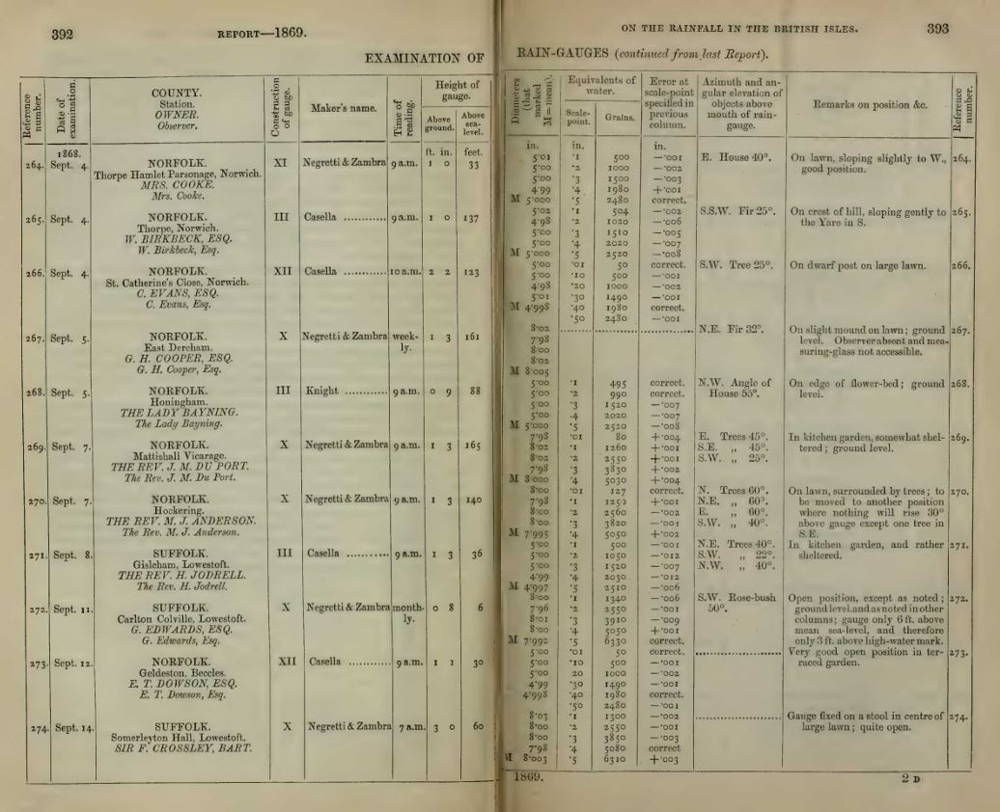

# British Association reports and rain gauge inspections 

For much of the 1860s and 1870s, George Symons produced a sizeable rainfall article for the annual meetings of the British Association for the Advancement of Science, initially under his own name
and then as secretary of the Association's Rainfall Committee. These articles were included in the Association's yearly meeting Reports.

[The Online Books website](https://onlinebooks.library.upenn.edu/webbin/serial?id=repmeetbaas) has a comprehensive set of links to digital versions of these meeting Reports, many of them 
on the [Internet Archive](https://archive.org/) site. 

BAAS Reports with a substantial Symons Rainfall report are:

|Report Year|Article|Page range|Link|
|-----------|-------|----------|----|
|1862|On the Fall of Rain in the British Isles during the Years 1860 and 1861|292-362|[Report](https://archive.org/details/reportofbritisha63brit)|
|1863|-|-|[Report](https://archive.org/details/reportofbritisha64brit)|
|1864|On the Fall of Rain in the British Isles during the Years 1862 and 1863|367-407|[Report](https://archive.org/details/reportofbritisha65brit)|
|1865|On the Rainfall of the British Isles|192-242|[Report](https://archive.org/details/reportofbritisha66brit)|
|1866|Report of the Rainfall Committee|281-351|[Report](https://archive.org/details/reportofbritisha67brit)|
|1867|Second Report of the Rainfall Committee|448-468|[Report](https://archive.org/details/reportofbritisha68brit)|
|1868|Report of the Rainfall Committee for the year 1867-68|432-474|[Report](https://archive.org/details/reportofbritisha69brit)|
|1869|Report of the Rainfall Committee for the year 1868-69|383-402|[Report](https://archive.org/details/reportofbritisha70brit)|
|1870|Report of the Rainfall Committee for the year 1869-70|170-229|[Report](https://archive.org/details/reportofbritisha71brit)|
|1871|Report on the Rainfall of the British Isles|98-116|[Report](https://archive.org/details/reportofbritisha72brit)|
|1872|Report on the Rainfall of the British Isles|176-209|[Report](https://archive.org/details/reportofbritisha73brit)|
|1873|Report on the Rainfall of the British Isles for the years 1872-73|257-303|[Report](https://archive.org/details/reportofbritisha74brit)|
|1874|Report on the Rainfall of the British Isles for the years 1873-74|75-117|[Report](https://archive.org/details/reportofbritisha75brit)|
|1875|Report of the Rainfall Committee for the year 1874-75|91-111|[Report](https://archive.org/details/reportofbritisha76brit)|
|1876|Report of the Rainfall of the British Isles for the years 1875-76|172-203|[Report](https://archive.org/details/reportofbritisha77brit)|

One common theme of Symons' articles was the importance of on-site inspections of his observers' rainfall gauges. The British Association provided a modest annual grant to
support this work, as well as to set up new gauges in parts of the country which were lacking observers. Most of the Reports for 1866-1876 include a table listing details of the inspections 
that Symons performed in the 1862-1876 period, covering 655 gauge inspections in total. For example:

For ease of reference, the page images for these tables of inspections have been extracted and put into a separate PDF document: [BAAS_RainGaugeInspections.pdf](BAAS_RainGaugeInspections.pdf). Stephen Burt has kindly produced a [searchable version](BAAS_RainGaugeInspections.searchable.pdf).

A few of the Rainfall Rescue team have transcribed the main inspection details and mapped the inspected sites to Rainfall Rescue stations; the results are recorded in [this spreadsheet](BAAS_Inspections.xlsx). Combining
these station mappings with the station locations determined by the Rainfall Rescue project (including a few corrections and adjustments which came to light from the inspection details) allows 
a [map](https://www.google.com/maps/d/edit?mid=1r8KHIsr6JHL_prh-_I5FfdJG6NnuWJo&usp=sharing) of the inspected stations to be produced, showing the various 'inspection tours' undertaken by Symons during the period.