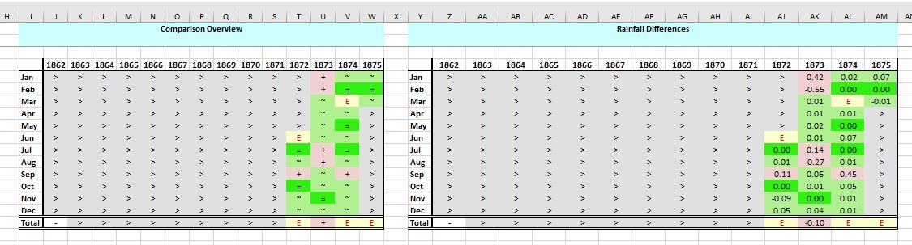
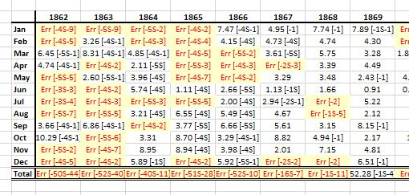
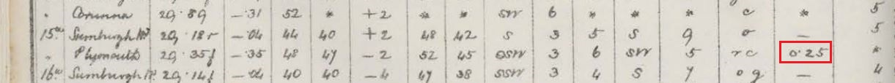

# Mapping Daily Weather Report Stations to Rainfall Rescue (British Rainfall) stations

In January 2024, Ed Hawkins and Philip Craig released digitised observations from the 1861-1875 Met Office Daily Weather Reports, transcribed by volunteers using the Zooniverse platform.

* [Digitizing observations from the 1861–1875 Met Office Daily Weather Reports using citizen scientist volunteers](https://rmets.onlinelibrary.wiley.com/doi/full/10.1002/gdj3.236)
* [Weather Rescue Data v2.1](https://zenodo.org/records/8057546)

The rescued observations include daily rainfall figures from a few tens of DWR stations in Great Britain and Ireland and some nearby countries. 

The 'Rainfall Rescue' project, also run by Ed Hawkins, has transcribed monthly rainfall figures from the Met Office ten-year rainfall sheets, originally collected by the British Rainfall Organisation. These monthly rainfall stations are referred to as 'British Rainfall stations' in the rest of this note. British Rainfall started receiving rainfall records from the Met Office from 1877 onwards.

The sections below record how the DWR rainfall stations relate to the British Rainfall stations, determined mostly by a combination of:
* identifying British Rainfall stations with 'Meteor. Council' or similar as the observer in the *British Rainfall* or on the ten-year rainfall sheets. These first appear in the 1877 edition of *British Rainfall*.
* aggregating the DWR daily rainfall observations into monthly figures, and comparing these with the British Rainfall monthly values transcribed by the Rainfall Rescue project
* DWR station history information from the Hawkins and Craig publication, early Met Office Annual Reports, and other sources

## DWR Stations with no related British Rainfall Station

Most of the DWR stations which had stopped appearing in the DWRs by 1875 have no related Rainfall Rescue station.

* Wick (initial site)
* Cape Clear, Galway, Greencastle (initial site), Portrush, Queenstown
* Holyhead (initial site), Milford Haven
* Berwick, London (Westminster sites), Penzance, Plymouth (initial site), Portland, Portsmouth
* Jersey

## DWR Stations active by 1875 but only appearing later in British Rainfall

Many of the DWR rainfall stations which were still active at the end of the 1861–1875 period appear as British Rainfall stations, but only from 1877 onwards. *British Rainfall* gives 'The Met. Council' or similar as observer for these records.

For these cases, there is no overlap in time between the 1861-1875 DWR data set and the rainfall figures held in British Rainfall for the same stations, so there is no comparison of monthly data.

 

|DWR Station|British Rainfall Station|
|:----------|:----------------------|
|Aberdeen|[ABERDEEN-BRAEMAR-PLACE](https://github.com/ed-hawkins/rainfall-rescue/blob/master/DATA/ABERDEEN-BRAEMAR-PLACE) (DWR moved to [ABERDEEN-OBSERVATORY](https://github.com/ed-hawkins/rainfall-rescue/tree/master/DATA/ABERDEEN-OBSERVATORY) in ~1889)|
|Dover|Two 'leftover' Kent ten-year sheets: [1870s](https://github.com/ed-hawkins/rainfall-rescue-leftover/blob/main/DATA/Kent/TYRain_1870-1879_01_pt3-page-025.jpg) and [1880s](https://github.com/ed-hawkins/rainfall-rescue-leftover/blob/main/DATA/Kent/TYRain_1880-1889_02_pt1-page-021.jpg)|
|Holyhead (Sailor's Home site)|[HOLYHEAD](https://github.com/ed-hawkins/rainfall-rescue/tree/master/DATA/HOLYHEAD)|
|Hurst Castle|[HURST-CASTLE](https://github.com/ed-hawkins/rainfall-rescue/tree/master/DATA/HURST-CASTLE)|
|Leith|[LEITH](https://github.com/ed-hawkins/rainfall-rescue/tree/master/DATA/LEITH)|
|Moville (nearby successor to Greencastle)|[MOVILLE-PROSPECT-VILLA](https://github.com/ed-hawkins/rainfall-rescue-data-eire/tree/main/DATA/MOVILLE-PROSPECT-VILLA)|
|Portishead|One 'leftover' Somerset ten-year sheet: [1870s](https://github.com/ed-hawkins/rainfall-rescue-leftover/blob/main/DATA/Somerset/TYRain_1870-1879_05_pt3-page-021.jpg)|
|Roche's Point|[ROCHES-POINT](https://github.com/ed-hawkins/rainfall-rescue/tree/master/DATA/ROCHES-POINT)|
|Scarborough|[SCARBOROUGH-MIX](https://github.com/ed-hawkins/rainfall-rescue/tree/master/DATA/SCARBOROUGH-MIX)|
|Shields|[NORTH-SHIELDS-POST-OFFICE](https://github.com/ed-hawkins/rainfall-rescue/tree/master/DATA/NORTH-SHIELDS-POST-OFFICE)|
|Stornoway|[STORNOWAY-MIX](https://github.com/ed-hawkins/rainfall-rescue/tree/master/DATA/STORNOWAY-MIX)|
|Sumburgh|[SUMBURGHEAD-DUNROSSNESS](https://github.com/ed-hawkins/rainfall-rescue/tree/master/DATA/SUMBURGHEAD-DUNROSSNESS)|
|Thurso|One 'leftover' Caithness ten-year sheet: [1870s](https://github.com/ed-hawkins/rainfall-rescue-leftover/blob/main/DATA/Caithness/TYRain_1870-1879_12_pt3-page-100.jpg)|
|Wick (Market Place site)|[WICK-COASTGUARD-STATION](WICK-COASTGUARD-STATION)|
|Yarmouth (Sailor's Home site)|[YARMOUTH-SAILORS-HOME](https://github.com/ed-hawkins/rainfall-rescue/tree/master/DATA/YARMOUTH-SAILORS-HOME)|

## DWR Stations with figures which match to British Rainfall

The remaining DWR rainfall stations in the 1861–1875 data-set have aggregate monthly rainfall figures that match up at least partially with a British Rainfall monthly station. 

A comparison spreadsheet for each site compares the month-by-month aggregated DWR 1861-1875 and Rainfall Rescue figures. (A section at the end of this note has more information on the comparison process.)

### Inland DWR Stations added in July 1872

In July 1872, four inland DWR stations were added to the DWR. 

|DWR Station|British Rainfall Station|Comparison Spreadsheet|Notes|
|:----------|:----------------------|:---------|:----|
|Cambridge|[CAMBRIDGE-OBSERVATORY](https://github.com/ed-hawkins/rainfall-rescue/tree/master/DATA/CAMBRIDGE-OBSERVATORY)|[Link](Comparisons/CAMBRIDGE-DWR-1861-1875-Comparison.xlsx)|Good match to British Rainfall for most months.|
|Nottingham|[NOTTINGHAM-HIGHFIELD-HOUSE](https://github.com/ed-hawkins/rainfall-rescue/tree/master/DATA/NOTTINGHAM-HIGHFIELD-HOUSE)|[Link](Comparisons/NOTTINGHAM-DWR-1861-1875-Comparison.xlsx)|British Rainfall monthly figures for 1875 match well, but there are no monthly figures for 1873 and 1874, and the figures for 1872 do not match.|
|Oxford|[OXFORD-RADCLIFFE](https://github.com/ed-hawkins/rainfall-rescue/tree/master/DATA/OXFORD-RADCLIFFE)|[Link](Comparisons/OXFORD-DWR-1861-1875-Comparison.xlsx)|Good match to the British Rainfall 'Lawns' series for most months.|
|York|[YORK-MUSEUM](https://github.com/ed-hawkins/rainfall-rescue/tree/master/DATA/YORK-MUSEUM)|[Link](Comparisons/YORK-DWR-1861-1875-Comparison.xlsx)|Good match to British Rainfall for 1873, the start of 1874, and 1875, but the second half of 1874 does not match well. There are no British Rainfall figures for 1872.|

### Coastal DWR Stations added in the early 1870s

These coastal stations, added to the DWR in and around the early 1870s, have at least partially matching figures in British Rainfall, with the monthly rainfall sheets recording the Met Council as the observer.

|DWR Station|British Rainfall Station|Comparison Spreadsheet|Notes|
|:----------|:----------------------|:---------|:----|
|Donaghadee|[DONAGHADEE](https://github.com/ed-hawkins/rainfall-rescue/tree/master/DATA/DONAGHADEE)|[Link](Comparisons/DONAGHADEE-DWR-1861-1875-Comparison.xlsx)|Good match to for most months 1873-1875. The British Rainfall monthly records for 1873-1876 were back-filled from another source.|
|Kingstown|[KINGSTOWN](https://github.com/ed-hawkins/rainfall-rescue-data-eire/tree/main/DATA/KINGSTOWN)|[Link](Comparisons/KINGSTOWN-DWR-1861-1875-Comparison.xlsx)|Good match to for most months 1873-1875. The British Rainfall monthly records for 1873-1876 were back-filled from another source.|
|Plymouth (Navigation School)|[PLYMOUTH-NAVIGATION-SCHOOL](https://github.com/ed-hawkins/rainfall-rescue/tree/master/DATA/PLYMOUTH-NAVIGATION-SCHOOL)|[Link](Comparisons/PLYMOUTH-DWR-1861-1875-Comparison.xlsx)|Mostly a good match to British Rainfall for 1870-1875, with a few big mismatches.
|Pembroke (St Ann's)|[PEMBROKE-ST-ANNS](https://github.com/ed-hawkins/rainfall-rescue/tree/master/DATA/PEMBROKE-ST-ANNS)|[Link](Comparisons/PEMBROKE-DWR-1861-1875-Comparison.xlsx)|British Rainfall has an 1870-71 record, observer J.L.Marriott, which is mostly a good match until mid-1871. There is then a gap until 1877 when a normal 'Met Council' record starts.|
|Scilly|[ST-MARYS-COASTGUARD-STATION](https://github.com/ed-hawkins/rainfall-rescue/tree/master/DATA/ST-MARYS-COASTGUARD-STATION)|[Link](Comparisons/SCILLY-DWR-1861-1875-Comparison.xlsx)|British Rainfall has a St Mary's record with readings for 1871, 1872 and 1874 (various observers), with the first half of 1871 and the middle of 1874 mostly matching well. There is then a gap until 1877 when a normal 'Met Council' record starts.|

### Other DWR Stations with brief matches to British Rainfall

|DWR Station|British Rainfall Station|Comparison Spreadsheet|Notes|
|:----------|:----------------------|:---------|:----|
|Ardrossan|[ARDROSSAN](https://github.com/ed-hawkins/rainfall-rescue/tree/master/DATA/ARDROSSAN)|[Link](Comparisons/ARDROSSAN-DWR-1861-1875-Comparison.xlsx)|DWR station from 1861 onwards, British Rainfall has a single year of readings in 1871 which are mostly a good match. Other than that, there is no BR content until 1877 when a normal 'Met Council' record starts.|
|Weymouth|[WEYMOUTH](https://github.com/ed-hawkins/rainfall-rescue/tree/master/DATA/WEYMOUTH-WESTHAM)|[Link](Comparisons/WEYMOUTH-DWR-1861-1875-Comparison.xlsx)|DWR station 1862-1868. One 1864-1867 Weymouth sheet in British Rainfall has a good match for some for 1866 and the second half of 1867. British Rainfall 1866 gives the observer as 'Preston Guardian', with 'The Times' given as the observer in British Rainfall 1867.|
|Nairn|[NAIRN-MIX](https://github.com/ed-hawkins/rainfall-rescue/tree/master/DATA/NAIRN-MIX)|[Link](Comparisons/NAIRN-DWR-1861-1875-Comparison.xlsx)|DWR station from 1861 onwards. One of the 'Nairn-Mix' sheets, labelled 'Nairn Station' has a good match for most months in 1873 and 1874 (but not 1872).
|...|[NAIRN](https://github.com/ed-hawkins/rainfall-rescue/tree/master/DATA/NAIRN)|[Link](Comparisons/NAIRN-DWR-1861-1875-Comparison.xlsx)|The 'Nairn' sheets include a normal 'Met Council' record starting in 1877, but also include 1870-1872 'Nairn School House' readings from the DWR observer Mr Penny. The 1871 and 1872 readings are a slight match for the DWR figures.

### London Brixton DWR Station

The 1861-1875 DWRs include a 'London' station. For the earlier years in this period, at the Westminster offices of the Met Office, there is no British Rainfall match. For 1871-1875, there is a very good match for the [BRIXTON-ACRE-LANE](https://github.com/ed-hawkins/rainfall-rescue/tree/master/DATA/BRIXTON-ACRE-LANE) British Rainfall station, observer 'The Met Council', with the British Rainfall station continuing to 1906. The figures on the British Rainfall sheet for 1871-1876 look like they have been back-filled, with British Rainfall not recording this site in its annual publication until 1878.

The Met Office Annual Report gives F.Gaster, a senior officer at the Met Office, as the named DWR observer from 1872 (before that the observer was just given as 'Clerks in the Meteorological Office')

For the London DWR station, the 1861-1875 data-set splits the station into 3 SEF files:
* 1862-1869 : Parliament Street
* 1869-1872 : Victoria Street : [Comparison spreadsheet](Comparisons/LONDON2-VIC-STREET-DWR-1861-1875-Comparison.xlsx)
* 1872-1875 : Acre Lane : [Comparison spreadsheet](Comparisons/LONDON3-BRIXTON-DWR-1861-1875-Comparison.xlsx)

If the British Rainfall Brixton Acre Lane station is correct, the Brixton DWR station started a year earlier than the split between the SEF files indicates; the Victoria Street comparison which a good match to the British Rainfall Brixton Acre Lane figures for 1871.

### Liverpool/Bidston Observatory DWR Station

The DWRs contain a 'Liverpool' entry from 1860 onwards, which changes to 'Liverpool (Bidston Obs.)' in mid 1871. The Met Office Annual Report 1871 says that the Liverpool instruments were formerly at the telegraph office in the centre of town, but that the observations were now being taken at the Bidston Observatory in Birkenhead.

Bidston Observatory ([map](https://maps.nls.uk/geo/explore/#zoom=15.7&lat=53.40083&lon=-3.07366&layers=6&b=1&marker=53.400735,-3.074226)) was set up when the Liverpool Observatory ([map](https://maps.nls.uk/geo/explore/#zoom=16.6&lat=53.41359&lon=-3.00217&layers=257&b=9&marker=51.45853,-2.59223)) had to close down at the end of 1866 because the Waterloo Docks were being extended.

The related British Rainfall monthly rainfall stations are:

* [LIVERPOOL-OBSERVATORY](https://github.com/ed-hawkins/rainfall-rescue/tree/master/DATA/LIVERPOOL-OBSERVATORY) 1846 to the end of 1866
* [BIDSTON-OBSERVATORY](https://github.com/ed-hawkins/rainfall-rescue/tree/master/DATA/BIDSTON-OBSERVATORY) from January 1867 onwards

[Comparison](Comparisons/LIVERPOOL-DWR-1861-1875-Comparison.xlsx) of the aggregated monthly DWR 1861-1875 figures with British Rainfall monthly figures shows:

* fairly close matching to LIVERPOOL-OBSERVATORY figures for a lot of months from 1863 to mid-1866
* fairly close matching to BIDSTON-OBSERVATORY figures for mid-1871 onwards
* but no matches for Liverpool Observatory after mid-1866 and no matches for Bidston Observatory before 1871

So a possible sequence of sites for the Liverpool DWR station which fits the comparison matches and the Met Office 1871 Annual Report statement would be:
* early 1860s - unclear
* 1863/1864 to mid-1866 at Liverpool Observatory (demolished Jan 1867)
* mid-1866 to mid-1871 at a central Liverpool Telegraph office ?
* mid-1871 onwards at Bidston Observatory

### Valentia DWR Station

There was a lot of telegraph and meteorology activity on and near Valentia Island in the 1861-1875 period:

Telegraph Station:
* the first Transatlantic telegraph message was received by the Telegraph Station at the Slate Yard in Knightstown, Valentia in 1858, although the cable stopped working shortly after this
* in 1865 a replacement Transatlantic cable reached the temporary Telegraph Station at Telegraph Field, Foilhomurrum Bay, Valentia - [map](https://maps.nls.uk/geo/explore/#zoom=16.1&lat=51.89327&lon=-10.38416&layers=6&b=9)
* in October 1868, the permanent Telegraph Station just south of Knightstown opened - [map](https://maps.nls.uk/geo/explore/#zoom=16.4&lat=51.92334&lon=-10.28955&layers=6&b=9)

Meteorological Observatory:
* the Met Office opened the Valentia Observatory at Revenue House in 1868, about a mile west of the permanent Telegraph Station - [map](https://maps.nls.uk/geo/explore/#zoom=16.4&lat=51.90998&lon=-10.30051&layers=6&b=9). The observatory used self-recording instruments.
* in 1892 the Valentia Observatory moved to the mainland, to a house near Cahirciveen - [map](https://maps.nls.uk/geo/explore/#zoom=16.8&lat=51.94087&lon=-10.24296&layers=6&b=9)

Daily Weather Report:
* the DWRs included a telegraphed report from Valentia from October 1860 onwards
* in mid-1876, the DWR reporting was taken over by the Valentia Observatory

British Rainfall monthly rainfall stations relevant to this are:

* [VALENTIA-MIX](https://github.com/ed-hawkins/rainfall-rescue/tree/master/DATA/VALENTIA-MIX), which contains a Met Council 'Telegraph Station' record from 1866 onwards, with the years before 1877 backfilled (in 1925?) from the Met Office Quarterly Reports. There is also a separate Valentia-Mix record with the Knight of Kerry as the observer for 1861-1870. A note on this record says two things potentially linking it to the DWT/Telegraph world: 
    * the gauge moved from Knightstown to Foilhomurrum (the temporary Telegraph station) in 1865
    * around the same time, a new gauge was substituted for the Fitzroy gauge.

* [VALENTIA-OBSERVATORY](https://github.com/ed-hawkins/rainfall-rescue/tree/master/DATA/VALENTIA-OBSERVATORY), which contains a Met Council 'Valentia Observatory' record from 1880 (not 1868) onwards, relabelled 'Cahirciveen Valentia Observatory' from 1892.

[Comparison](Comparisons/VALENTIA-DWR-1861-1875-Comparison.xlsx) of the aggregated monthly DWR 1861-1875 figures with British Rainfall monthly figures shows a lot of good matches for the Valentia-Mix Telegraph record 1866-1870, which is part of the period of back-filled figures taken from Met Office Quarterly Reports. There's little match to the Valentia-Mix Knight of Kerry record, depsite its possible DWR links, although the Valentia DWR record has lots of missing days in its earlier years.

## Comparison Spreadsheets

The [comparison spreadsheets](Comparisons) referenced in previous sections were produced by comparing monthly rainfall records from British Rainfall stations with aggregated daily rainfall figures from the Daily Weather Report stations.

### Definition of the monthly period for DWR stations

The 8 am DWR rainfall readings record the rainfall for the previous 24 hours, so the rainfall recorded in the DWR for the first day of a month relates to the new month and the previous one. 

The 1865 edition of *British Rainfall* discusses this aspect of producing monthly rainfall figures from daily mid-morning obserations. After polling his observers, George Symons decided that the standard would be for rainfall readings taken mid-morning (actually 9 am for BR) on the first of the month to be allocated to the monthly rainfall of the previous month. 

The aggregated monthly rainfall for DWR stations has been calculated here in the same way. For example, the DWR rainfall assigned to June is the sum of the readings in the DWR reports for the 2nd May to the 1st June inclusive.

### Observations for Sundays and holidays in the DWR

In the early years of the DWRs, there was usually no report published on 'non-working' days: Sundays, Good Friday and Christmas Day. This was the case until Good Friday 19th April 1867, after which Sundays and holidays did have DWRs.

This raises the question of what happened to the rainfall that would have been reported in these non-working Sunday and holiday DWRs:
* did the rainfall figure in the Monday DWR include the rainfall that would have been present in the Sunday report, so that the Monday DWR figure covers rainfall for two days (Saturday 8 am to Monday 8 am) ?
* or is the Monday DWR figure just for the preceding 24 hours (Sunday 8 am to Monday 8 am), with any rainfall for the 24 hours before that (Saturday 8 am to Sunday 8 am) going unrecorded in the DWR ?

Analysis (see [Zooniverse Talk discussions](https://www.zooniverse.org/projects/edh/rainfall-rescue/talk/3143/1358833?comment=5329536)) of the Monday DWR rainfall figures following a 'non-working' Sunday show that the average Monday rainfall figure was significantly higher than other days, with fewer zero-rainfall days. This suggests that in many cases the non-working Sunday reading was combined into the following Monday's DWR figure.

If so, the process of aggregating the daily DWR rainfall figures to produce a monthly figure should not be much affected by the missing DWRs on 'non-working' days. However, it does mean that where a non-working Sunday was the 1st of the month, the 2-day rainfall figure in the Monday DWR contains a contribution from two different rainfall months, but the whole of the 2-day rainfall will have been allocated by the aggregation process to the later month.

### Other missing observations in the DWR

As well as the Sundays and holidays in the early years of the DWR not having rainfall readings, there are other days in the 1861-1875 period with missing DWR data (for some or all stations) in the SEF data-set files:
* late-arriving figures and corrections to the DWRs (noted on later DWRs or as an end-of-month batch) have not been transcribed, so the SEF files just contain rainfall entries from the day of DWR itself
* there are a few normal working days where the DWR seems to be missing from the Met Office online archive
* there are a few normal working days where the DWR is present in the Met Office online archive, but for some reason hasn't been transcribed, so doesn't contribute to the SEF files

In these cases, the monthly rainfall totally produced by the aggregation of the daily DWR values may be too small, depending on whether rain fell during the missing days. The aggregation process treats months with more than one missing day as error cases, and does not produce a monthly figure.

### Comparison Spreadsheets

Each comparison spreadsheet compares aggregated monthly rainfall from one SEF file with the monthly rainfall from one or more related CSV files generated for British Rainfall stations by the Rainfall Rescue project.

The spreadsheet shows the comparison results in a month-by-month grid for the years 1862-1875:
* cells coloured bright green show a month with an exact rainfall match between DWR and British Rainfall stations
* cells coloured pale green show a near match for the month, with the difference in rainfall being less than 0.1 inches
* cells coloured pale pink have a difference in rainfall for the month of more than 0.1 inches
* cells coloured grey relate to a month where a reading is available from only one of the two sources, so no comparison is possible
* cells coloured pale yellow are error cases where no DWR monthly aggregated was calculated because more than one daily value is missing for the month (see previous section), so no comparison is possible

The comparison table is repeated in two formats using these colours:
* showing just a high-level indicator of the comparison outcome
* showing the actual difference in monthly rainfall 

The actually monthly figures being compared for the DWR and British Rainfall stations are also shown in the same table layout form. For the DWR figures, information in square brackets shows how many days are missing for the month, with 'S' indicating non-working days missing.

### Comparison mismatch reasons

Where the same source station has produced the monthly rainfall figures for both a DWR station and a British Rainfall station, the comparison spreadsheet should ideally show no differences between the monthly figures from the two sources. In practice, we don't see that for a lot of cases; reasons for mismatches could include:

* for early years, a difference in the period used to define the month, particularly how readings taken on the first of the month were handled
* for early years, rainfall might be missing from the DWR because of Sundays and holidays 
* errors introduced during the transmission of readings to the Met Office over the telegraph system (the Met Office Annual Report for 1874 discusses these)
* DWR readings that have not been transcribed:
  * corrections or late-arriving records
  * a few DWRs that are missing from the Met Office online archive
  * a few DWRs that are missing from the 1861-1875 data-set
* the BR monthly figures were presumably produced by aggregating daily figures, and so there may be some errors introduced by this process
* incorrect transcriptions in the DWR or British Rainfall data rescue processes

### Example of a late-arriving DWR reading accounting for a comparison mismatch

Using the transcribed DWR readings from the SEF file the Plymouth DWR Station for February 1874 gives an aggregate monthly rainfall of 2.47 inches, but with no reading on 15th February. The British Rainfall PLYMOUTH-NAVIGATION-SCHOOL station has monthly rainfall of 2.72 inches for the same month, 0.25 inches larger.

The Additions section of the February 1874 DWR shows an entry for 15th February for Plymouth, with rainfall of 0.25 inches:

