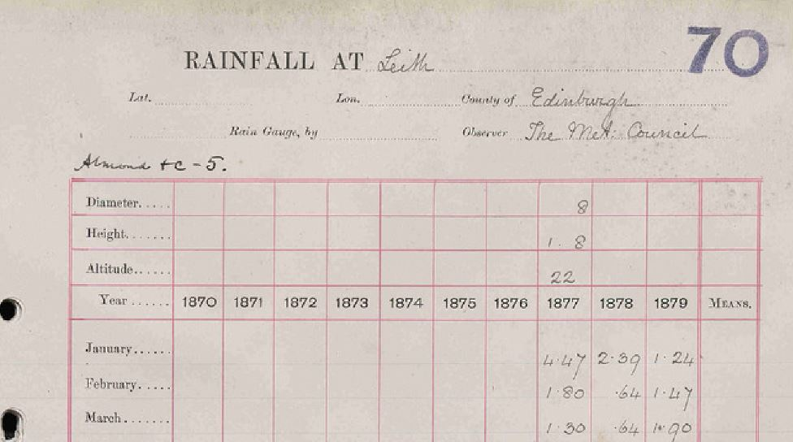

# Mapping Daily Weather Report Stations to Rainfall Rescue (British Rainfall) stations

In January 2024, Ed Hawkins and Philip Craig released digitised observations from the 1861-1875 Met Office Daily Weather Reports, transcribed by volunteers in 2019 using the Zooniverse platform.

* [Digitizing observations from the 1861–1875 Met Office Daily Weather Reports using citizen scientist volunteers](https://rmets.onlinelibrary.wiley.com/doi/full/10.1002/gdj3.236)
* [Weather Rescue Data v2.1](https://zenodo.org/records/8057546)

The rescued observations include daily rainfall figures from a few tens of DWR stations in Great Britain and Ireland and some nearby countries. 

This note records how the DWR rainfall stations relate to the British Rainfall monthly rainfall stations in Great Britain and Ireland, mostly by a combination of:
* identifying British Rainfall stations with 'Meteor. Council' or similar as the observer in the British Rainfall almanacs or on the ten-year rainfall sheets. These first appear in the 1877 edition of British Rainfall.
* aggregating the DWR daily rainfall observations into monthly figures, and comparing these with the British Rainfall values transbribed by the Rainfall Rescue project
* DWR station history information from the Hawkins and Craig publication, early Met Office Annual Reports, and other sources

## DWR Stations with no related British Rainfall Station

Most of the DWR stations which had stopped appearing in the DWRs by 1875 (i.e. before the Met Office began supplying records to British Rainfall in 1877) have no related British Rainfall station:

* Aberdeen, Wick (initial site)
* Cape Clear, Galway, Greencastle (initial site), Portrush, Queenstown
* Holyhead (initial site), Milford Haven
* Berwick, London (Westminster sites), Penzance, Plymouth (initial site), Portland, Portsmouth
* Jersey

## DWR Stations active by 1875 but only appearing later in British Rainfall

Many of the DWR rainfall stations which were still active at the end of the 1861–1875 period appear in British Rainfall only from 1877 onwards. British Rainfall gives 'The Met. Council' or similar as observer for these records. 1877 was the point at which the Met Office began supplying its rainfall records to British Rainfall, usually with no back-filling. 

For these cases, there is no overlap in time between the 1861-1875 DWR data set and the rainfall figures held in British Rainfall for the same sites.

 

|DWR Station|British Rainfall Station|
|:----------|:----------------------|
|Dover|Two 'leftover' Kent ten-year sheets: [1870s](https://github.com/ed-hawkins/rainfall-rescue-leftover/blob/main/DATA/Kent/TYRain_1870-1879_01_pt3-page-025.jpg) and [1880s](https://github.com/ed-hawkins/rainfall-rescue-leftover/blob/main/DATA/Kent/TYRain_1880-1889_02_pt1-page-021.jpg)|
|Holyhead (Sailor's Home site)|[HOLYHEAD](https://github.com/ed-hawkins/rainfall-rescue/tree/master/DATA/HOLYHEAD)|
|Hurst Castle|[HURST-CASTLE](https://github.com/ed-hawkins/rainfall-rescue/tree/master/DATA/HURST-CASTLE)|
|Leith|[LEITH](https://github.com/ed-hawkins/rainfall-rescue/tree/master/DATA/LEITH)|
|Moville (successor to Greencastle)|[MOVILLE-PROSPECT-VILLA](https://github.com/ed-hawkins/rainfall-rescue-data-eire/tree/main/DATA/MOVILLE-PROSPECT-VILLA)|
|Portishead|One 'leftover' Somerset ten-year sheet: [1870s](https://github.com/ed-hawkins/rainfall-rescue-leftover/blob/main/DATA/Somerset/TYRain_1870-1879_05_pt3-page-021.jpg)|
|Roche's Point|[ROCHES-POINT](https://github.com/ed-hawkins/rainfall-rescue/tree/master/DATA/ROCHES-POINT)|
|Scarborough|[SCARBOROUGH-MIX](https://github.com/ed-hawkins/rainfall-rescue/tree/master/DATA/SCARBOROUGH-MIX)|
|Shields|[NORTH-SHIELDS-POST-OFFICE](https://github.com/ed-hawkins/rainfall-rescue/tree/master/DATA/NORTH-SHIELDS-POST-OFFICE)|
|Stornoway|[STORNOWAY-MIX](https://github.com/ed-hawkins/rainfall-rescue/tree/master/DATA/STORNOWAY-MIX)|
|Sumburgh|[SUMBURGHEAD-DUNROSSNESS](https://github.com/ed-hawkins/rainfall-rescue/tree/master/DATA/SUMBURGHEAD-DUNROSSNESS)|
|Thurso|One 'leftover' Caithness ten-year sheet: [1870s](https://github.com/ed-hawkins/rainfall-rescue-leftover/blob/main/DATA/Caithness/TYRain_1870-1879_12_pt3-page-100.jpg)|
|Wick (Market Place site)|[WICK-COASTGUARD-STATION](WICK-COASTGUARD-STATION)|
|Yarmouth (Sailor's Home site)|[YARMOUTH-SAILORS-HOME.csv](https://github.com/ed-hawkins/rainfall-rescue/tree/master/DATA/YARMOUTH-SAILORS-HOME)|

## DWR Stations with figures which match to British Rainfall

The remaining DWR rainfall stations in the 1861–1875 data-set have aggregate monthly rainfall figures that match up at least partially with a British Rainfall monthly rainfall station. 

A comparison spreadsheet for each site compares the month-by-month aggregated DWR 1861-1875 and British Rainfall (BR) figures.

### Inland DWR Stations added in July 1872

In July 1872, four 'institutional' DWR stations were added to the DWR. 

|DWR Station|British Rainfall Station|Comparison Spreadsheet|Notes|
|:----------|:----------------------|:---------|:----|
|Cambridge|[CAMBRIDGE-OBSERVATORY](https://github.com/ed-hawkins/rainfall-rescue/tree/master/DATA/CAMBRIDGE-OBSERVATORY)|[Link](Comparisons/CAMBRIDGE-DWR-1861-1875-Comparison.xlsx)|Good match to British Rainfall for most months.|
|Nottingham|[NOTTINGHAM-HIGHFIELD-HOUSE](https://github.com/ed-hawkins/rainfall-rescue/tree/master/DATA/NOTTINGHAM-HIGHFIELD-HOUSE)|[Link](Comparisons/NOTTINGHAM-DWR-1861-1875-Comparison.xlsx)|British Rainfall readings for 1875 match well, but are missing for 1873 and 1874, and don't match for 1872.|
|Oxford|[OXFORD-RADCLIFFE](https://github.com/ed-hawkins/rainfall-rescue/tree/master/DATA/OXFORD-RADCLIFFE)|[Link](Comparisons/OXFORD-DWR-1861-1875-Comparison.xlsx)|Good match to the 'Lawns' series in British Rainfall for most months.|
|York|[YORK-MUSEUM](https://github.com/ed-hawkins/rainfall-rescue/tree/master/DATA/YORK-MUSEUM)|[Link](Comparisons/YORK-DWR-1861-1875-Comparison.xlsx)|Good match to British Rainfall for 1873, the start of 1874, and 1875, but the second half of 1874 does not match well. There are no BR readings for 1872.|

### Coastal DWR Stations added in the early 1870s

These coastal stations, added to the DWR in and around the early 1870s, have at least partially matching figures in British Rainfall, with the Met Council recorded as the observer.

|DWR Station|British Rainfall Station|Comparison Spreadsheet|Notes|
|:----------|:----------------------|:---------|:----|
|Donaghadee|[DONAGHADEE](https://github.com/ed-hawkins/rainfall-rescue/tree/master/DATA/DONAGHADEE)|[Link](Comparisons/DONAGHADEE-DWR-1861-1875-Comparison.xlsx)|Good match to British Rainfall for most months 1873-1875. BR Records for 1873-1876 have been back-filled.|
|Kingstown|[KINGSTOWN](https://github.com/ed-hawkins/rainfall-rescue-data-eire/tree/main/DATA/KINGSTOWN)|[Link](Comparisons/KINGSTOWN-DWR-1861-1875-Comparison.xlsx)|Good match to British Rainfall for most months 1873-1875. BR Records for 1873-1876 have been back-filled.|
|Plymouth (Navigation School)|[PLYMOUTH-NAVIGATION-SCHOOL](https://github.com/ed-hawkins/rainfall-rescue/tree/master/DATA/PLYMOUTH-NAVIGATION-SCHOOL)|[Link](Comparisons/PLYMOUTH-DWR-1861-1875-Comparison.xlsx)|Mostly a good match to British Rainfall for 1870-1875, with a few big mismatches. Record continues to 1886 with observer as Merrifield.|
|Pembroke (St Ann's)|[PEMBROKE-ST-ANNS](https://github.com/ed-hawkins/rainfall-rescue/tree/master/DATA/PEMBROKE-ST-ANNS)|[Link](Comparisons/PEMBROKE-DWR-1861-1875-Comparison.xlsx)|British Rainfall has an 1870-71 record, observer Marriott, which is mostly a good match until mid 1871. There is then a gap until 1877 when a normal 'Met Council' record starts.|
|Scilly|[ST-MARYS-COASTGUARD-STATION](https://github.com/ed-hawkins/rainfall-rescue/tree/master/DATA/ST-MARYS-COASTGUARD-STATION)|[Link](Comparisons/SCILLY-DWR-1861-1875-Comparison.xlsx)|British Rainfall has a St Mary's record with readings for 1871, 1872 and 1874 (various observers), with the first half of 1871 and the middle of 1874 mostly matching well. There is then a gap until 1877 when a normal 'Met Council' record starts.|

### Other DWR Stations with brief matches to British Rainfall

|DWR Station|British Rainfall Station|Comparison Spreadsheet|Notes|
|:----------|:----------------------|:---------|:----|
|Ardrossan|[ARDROSSAN](https://github.com/ed-hawkins/rainfall-rescue/tree/master/DATA/ARDROSSAN)|[Link](Comparisons/ARDROSSAN-DWR-1861-1875-Comparison.xlsx)|DWR station from 1861 onwards, British Rainfall has a single year of readings in 1871 which are mostly a good match. Other than that, there is no BR content until 1877 when a normal 'Met Council' record starts.|
|Weymouth|[WEYMOUTH](https://github.com/ed-hawkins/rainfall-rescue/tree/master/DATA/WEYMOUTH-WESTHAM)|[Link](Comparisons/WEYMOUTH-DWR-1861-1875-Comparison.xlsx)|DWR station 1862-1868. One 1864-1867 Weymouth sheet in British Rainfall has a good match for some for 1866 and the second half of 1867. British Rainfall 1866 gives the observer as 'Preston Guardian', with 'The Times' given as the observer in British Rainfall 1867.|
|Nairn|[NAIRN-MIX](https://github.com/ed-hawkins/rainfall-rescue/tree/master/DATA/NAIRN-MIX)|[Link](Comparisons/NAIRN-DWR-1861-1875-Comparison.xlsx)|DWR station from 1861 onwards. One of the 'Nairn-Mix' sheets, labelled 'Nairn Station' has a good match for most months in 1873 and 1874 (but not 1872).
|...|[NAIRN](https://github.com/ed-hawkins/rainfall-rescue/tree/master/DATA/NAIRN)|[Link](Comparisons/NAIRN-DWR-1861-1875-Comparison.xlsx)|The 'Nairn' sheets include a normal 'Met Council' record starting in 1877, but also include 1870-1872 'Nairn School House' readings from the DWR observer Mr Penny. The 1871 and 1872 readings are a slight match for the DWR figures.

### London Brixton Station

The 1861-1875 DWRs include a 'London' station. For the earlier years, which seems to have been at the Westminster offices of the Met Office - there is no British Rainfall match for these figures. For 1871-1875, there is a very good match for the [BRIXTON-ACRE-LANE](https://github.com/ed-hawkins/rainfall-rescue/tree/master/DATA/BRIXTON-ACRE-LANE) British Rainfall station, observer 'The Met Council', with the British Rainfall station continuing to 1906. The Met Office Annual Report gives F.Gaster, a senior officer at the Met Office, as the DWR observer. 

For the London DWR station, the 1861-1875 data-set splits the station into 3 SEF files:
* 1862-1869 : Parliament Street
* 1869-1872 : Victoria Street : [Comparison spreadsheet](Comparisons/LONDON2-VIC-STREET-DWR-1861-1875-Comparison.xlsx)
* 1872-1875 : Acre Lane : [Comparison spreadsheet](Comparisons/LONDON3-BRIXTON-DWR-1861-1875-Comparison.xlsx)

If the British Rainfall Brixton Acre Lane station is correct, the Brixton station started a year earlier than indicated by the split between the SEF files indicate, as demonstrated in the Victoria Street comparison.

### Liverpool / Bidston Station

tbd

### Valentia Station

There was a lot of telegraph and meteorology activity on and near Valentia Island in the 1861-1875 period:

Telegraph Station:
* the first Transatlantic telegraph message was received by the Telegraph Station at the Slate Yard in Knightstown in 1858, although the cable stopped working shortly after this
* in 1865 a replacement Transatlantic cable reached the temporary Telegraph Station at Telegraph Field, Foilhomurrum Bay - [map](https://maps.nls.uk/geo/explore/#zoom=16.1&lat=51.89327&lon=-10.38416&layers=6&b=9)
* in October 1868, the permanent Telegraph Station just south of Knightstown opened - [map](https://maps.nls.uk/geo/explore/#zoom=16.4&lat=51.92334&lon=-10.28955&layers=6&b=9)

Meteorological Observatory:
* the Met Office opened the Valentia Observatory at Revenue House in 1868, about a mile west of the permanent Telegraph Station - [map](https://maps.nls.uk/geo/explore/#zoom=16.4&lat=51.90998&lon=-10.30051&layers=6&b=9). The observatory used self-recording instruments.
* in 1892 the Valentia Observatory moved to the mainland, to a house near Cahirciveen - [map](https://maps.nls.uk/geo/explore/#zoom=16.8&lat=51.94087&lon=-10.24296&layers=6&b=9)

Daily Weather Report:
* the DWRs included a telegraphed report from Valentia from October 1860 onwards
* in mid-1876, the DWR reporting was taken over by the Valentia Observatory

British Rainfall monthly rainfall sheets relevant to this are:

* [VALENTIA-MIX](https://github.com/ed-hawkins/rainfall-rescue/tree/master/DATA/VALENTIA-MIX), which contains a Met Council 'Telegraph Station' record from 1866 onwards, with the years before 1877 backfilled (in 1925?) from the Met Office Quarterly Reports. There is also a separate Valentia record with the Knight of Kerry as the observer for 1861-1870. A note on this record says two relevant things potentially linking it to the DWT/Telegraph world: i) the gauge moved from Knightstown to Foilhomurrum (the temporary Telegraph station) in 1865; ii) around the same time, a new gauge was substituted for the Fitzroy gauge.

* [VALENTIA-OBSERVATORY](https://github.com/ed-hawkins/rainfall-rescue/tree/master/DATA/VALENTIA-OBSERVATORY)
