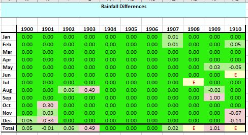

# Mapping 1900-1910 Daily Weather Report Stations to Rainfall Rescue (British Rainfall) stations

## Straight-forward good matches to British Rainfall stations

These DWR stations all match very well to a British Rainfall station, with most months having an exact match, producing a Comparison Spreadsheet similar to this :

 

|DWR Station|British Rainfall Station|Comparison Spreadsheet|
|:----------|:----------------------|:---------|
|Blacksod Point|[BLACKSOD-POINT](https://github.com/ed-hawkins/rainfall-rescue/tree/master/DATA/BLACKSOD-POINT)|[Link](Comparisons/BLACKSOD-POINT-DWR-1900-1910-Comparison.xlsx)|
|Castlebay (Barra Island)|[BARRA-CASTLE-BAY](https://github.com/ed-hawkins/rainfall-rescue/tree/master/DATA/BARRA-CASTLE-BAY)|[Link](Comparisons/CASTLEBAY-DWR-1900-1910-Comparison.xlsx)|
|Clacton-on-Sea|[CLACTON-ON-SEA](https://github.com/ed-hawkins/rainfall-rescue/tree/master/DATA/CLACTON-ON-SEA)|[Link](Comparisons/CLACTON-DWR-1900-1910-Comparison.xlsx)|
|Donaghadee|[DONAGHADEE](https://github.com/ed-hawkins/rainfall-rescue/tree/master/DATA/DONAGHADEE)|[Link](Comparisons/DONAGHADEE-DWR-1900-1910-Comparison.xlsx)|
|Dover|[DOVER-WATERLOO-CRESCENT](https://github.com/ed-hawkins/rainfall-rescue/tree/master/DATA/DOVER-WATERLOO-CRESCENT)|[Link](Comparisons/DOVER-DWR-1900-1910-Comparison.xlsx)|
|Dungeness|[DUNGENESS-LIGHTHOUSE](https://github.com/ed-hawkins/rainfall-rescue/tree/master/DATA/DUNGENESS-LIGHTHOUSE)|[Link](Comparisons/DUNGENESS-DWR-1900-1910-Comparison.xlsx)|
|Holyhead|[HOLYHEAD-SALT-ISLAND](https://github.com/ed-hawkins/rainfall-rescue/tree/master/DATA/HOLYHEAD-SALT-ISLAND)|[Link](Comparisons/HOLYHEAD-DWR-1900-1910-Comparison.xlsx)|
|Jersey (St Aubin's)|[JERSEY-ST-AUBINS](https://github.com/ed-hawkins/rainfall-rescue/tree/master/DATA/JERSEY-ST-AUBINS)|[Link](Comparisons/JERSEY-DWR-1900-1910-Comparison.xlsx)|
|Leith|[LEITH](https://github.com/ed-hawkins/rainfall-rescue/tree/master/DATA/LEITH)|[Link](Comparisons/LEITH-DWR-1900-1910-Comparison.xlsx)|
|London (Brixton)|[BRIXTON-ACRE-LANE](https://github.com/ed-hawkins/rainfall-rescue/tree/master/DATA/BRIXTON-ACRE-LANE)|[Link](Comparisons/LONDON1-BRIXTON-DWR-1900-1910-Comparison.xlsx)|
|London (St James's Park)|[WESTMINSTER-ST-JAMES-PARK](https://github.com/ed-hawkins/rainfall-rescue/tree/master/DATA/WESTMINSTER-ST-JAMES-PARK)|[Link](Comparisons/LONDON2-ST-JAMES-PARK-DWR-1900-1910-Comparison.xlsx)|
|Loughborough|[LOUGHBOROUGH-VICTORIA-STREET](https://github.com/ed-hawkins/rainfall-rescue/tree/master/DATA/LOUGHBOROUGH-VICTORIA-STREET)|[Link](Comparisons/LOUGHBOROUGH-DWR-1900-1910-Comparison.xlsx)|
|Malin Head|[MALIN-HEAD](https://github.com/ed-hawkins/rainfall-rescue/tree/master/DATA/MALIN-HEAD)|[Link](Comparisons/MALIN-HEAD-DWR-1900-1910-Comparison.xlsx)||
|Nairn|[NAIRN](https://github.com/ed-hawkins/rainfall-rescue/tree/master/DATA/NAIRN)|[Link](Comparisons/NAIRN-DWR-1900-1910-Comparison.xlsx)|
|North Shields|[NORTH-SHIELDS-POST-OFFICE](https://github.com/ed-hawkins/rainfall-rescue/tree/master/DATA/NORTH-SHIELDS-POST-OFFICE)|[Link](Comparisons/SHIELDS-DWR-1900-1910-Comparison.xlsx)|
|Pembroke (St Ann's Head)|[PEMBROKE-ST-ANNS](https://github.com/ed-hawkins/rainfall-rescue/tree/master/DATA/PEMBROKE-ST-ANNS)|[Link](Comparisons/PEMBROKE-DWR-1900-1910-Comparison.xlsx)|
|Portland Bill (Old Lighthouse)|[PORTLAND-BILL](https://github.com/ed-hawkins/rainfall-rescue/tree/master/DATA/PORTLAND-BILL)|[Link](Comparisons/PORTLAND-BILL1-DWR-1900-1910-Comparison.xlsx)||
|Portland Bill (New Lighthouse)|[PORTLAND-BILL](https://github.com/ed-hawkins/rainfall-rescue/tree/master/DATA/PORTLAND-BILL)|[Link](Comparisons/PORTLAND-BILL2-DWR-1900-1910-Comparison.xlsx)||
|Roche's Point|[ROCHES-POINT](https://github.com/ed-hawkins/rainfall-rescue/tree/master/DATA/ROCHES-POINT)|[Link](Comparison/ROCHES-POINT-DWR-1900-1910-Comparison.xlsx)|
|Scilly|[ST-MARYS-COASTGUARD-STATION](https://github.com/ed-hawkins/rainfall-rescue/tree/master/DATA/ST-MARYS-COASTGUARD-STATION)|[Link](Comparisons/)|
|Spurn Head|[PATRINGTON-SPURN-HEAD](https://github.com/ed-hawkins/rainfall-rescue/tree/master/DATA/PATRINGTON-SPURN-HEAD)|[Link](Comparisons/SPURN-HEAD-DWR-1900-1910-Comparison.xlsx)|
|Stornoway (Kenneth St)|[STORNOWAY-MIX](https://github.com/ed-hawkins/rainfall-rescue/tree/master/DATA/STORNOWAY-MIX)|[Link](Comparisons/STORNOWAY1-DWR-1900-1910-Comparison.xlsx)|
|Stornoway (Scotland St)|[STORNOWAY-MIX](https://github.com/ed-hawkins/rainfall-rescue/tree/master/DATA/STORNOWAY-MIX)|[Link](Comparisons/STORNOWAY2-DWR-1900-1910-Comparison.xlsx)|
|Stornoway (Lewis St)|[STORNOWAY-MIX](https://github.com/ed-hawkins/rainfall-rescue/tree/master/DATA/STORNOWAY-MIX)|[Link](Comparisons/STORNOWAY3-DWR-1900-1910-Comparison.xlsx)|
|Sumburgh Head|[SUMBURGHEAD-DUNROSSNESS](https://github.com/ed-hawkins/rainfall-rescue/tree/master/DATA/SUMBURGHEAD-DUNROSSNESS)|[Link](Comparisons/SUMBURGH-DWR-1900-1910-Comparison.xlsx)|
|Wick|[WICK-COASTGUARD-STATION](https://github.com/ed-hawkins/rainfall-rescue/tree/master/DATA/WICK-COASTGUARD-STATION)|[Link](WICK-DWR-1900-1910-Comparison.xlsx)|
|Yarmouth|[YARMOUTH-SAILORS-HOME](https://github.com/ed-hawkins/rainfall-rescue/tree/master/DATA/YARMOUTH-SAILORS-HOME)|[Link](Comparisons/YARMOUTH-DWR-1900-1910-Comparison.xlsx)|

## Other matches to British Rainfall stations

The other British and Irish DWR rainfall stations also match well to British Rainfall stations, but less exactly. For most of them, the 1900-1910 period has a close, but not quite exact, match to the British Rainfall site. 

Possibly the slight differences are caused by the British Rainfall site using a 9 am daily reading, whereas the DWR reporting is based on 8 am, and then 7 am on July 1st 1908 (although Oxford and Birr Castle continued to use 8 am). All these sites are inland/observatory type sites, and so may have had hourly rainfall recording, enabling the station to potentially use different definitions of 'daily' for British Rainfall and the DWR.

### Aberdeen
### Birr Castle (Parsonstown)
### Liverpool (Bidston Obs.)
### Nottingham
### Oxford
### Valentia
### Bath

