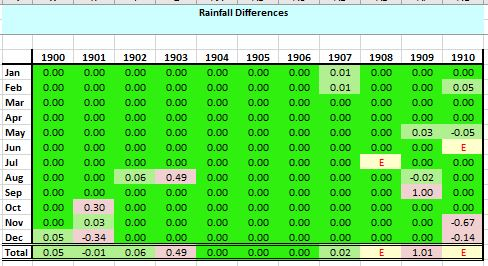
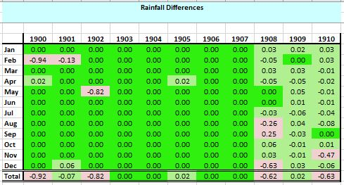
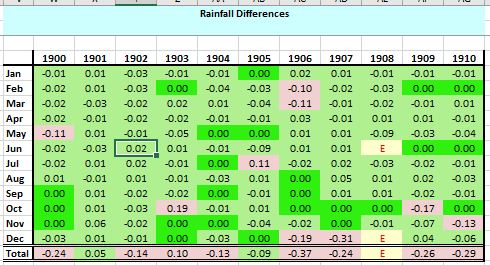
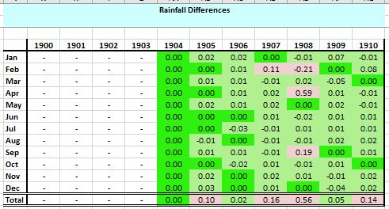
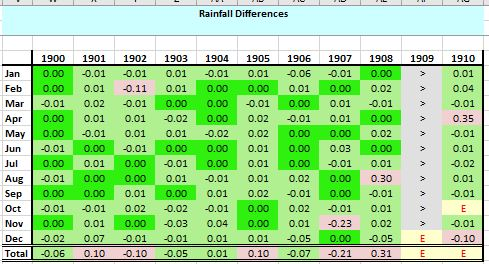
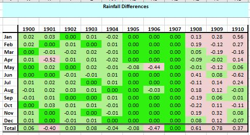
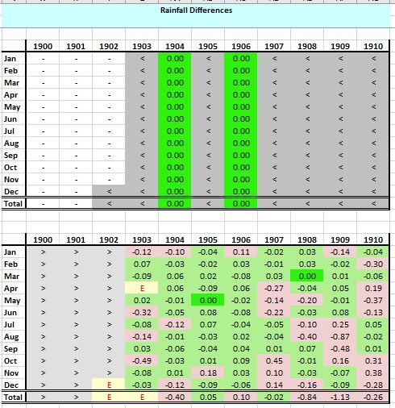

# Mapping 1900-1910 Daily Weather Report Stations to Rainfall Rescue (British Rainfall) stations

## Exact matches to British Rainfall stations

These DWR stations all match very well to a British Rainfall station, with most months having an exact match, producing a Comparison Spreadsheet similar to this :

 

|DWR Station|British Rainfall Station|Comparison Spreadsheet|
|:----------|:----------------------|:---------|
|Blacksod Point|[BLACKSOD-POINT](https://github.com/ed-hawkins/rainfall-rescue/tree/master/DATA/BLACKSOD-POINT)|[Link](Comparisons/BLACKSOD-POINT-DWR-1900-1910-Comparison.xlsx)|
|Castlebay (Barra Island)|[BARRA-CASTLE-BAY](https://github.com/ed-hawkins/rainfall-rescue/tree/master/DATA/BARRA-CASTLE-BAY)|[Link](Comparisons/CASTLEBAY-DWR-1900-1910-Comparison.xlsx)|
|Clacton-on-Sea|[CLACTON-ON-SEA](https://github.com/ed-hawkins/rainfall-rescue/tree/master/DATA/CLACTON-ON-SEA)|[Link](Comparisons/CLACTON-DWR-1900-1910-Comparison.xlsx)|
|Donaghadee|[DONAGHADEE](https://github.com/ed-hawkins/rainfall-rescue/tree/master/DATA/DONAGHADEE)|[Link](Comparisons/DONAGHADEE-DWR-1900-1910-Comparison.xlsx)|
|Dover|[DOVER-WATERLOO-CRESCENT](https://github.com/ed-hawkins/rainfall-rescue/tree/master/DATA/DOVER-WATERLOO-CRESCENT)|[Link](Comparisons/DOVER-DWR-1900-1910-Comparison.xlsx)|
|Dungeness|[DUNGENESS-LIGHTHOUSE](https://github.com/ed-hawkins/rainfall-rescue/tree/master/DATA/DUNGENESS-LIGHTHOUSE)|[Link](Comparisons/DUNGENESS-DWR-1900-1910-Comparison.xlsx)|
|Holyhead|[HOLYHEAD-SALT-ISLAND](https://github.com/ed-hawkins/rainfall-rescue/tree/master/DATA/HOLYHEAD-SALT-ISLAND)|[Link](Comparisons/HOLYHEAD-DWR-1900-1910-Comparison.xlsx)|
|Jersey (St Aubin's)|[JERSEY-ST-AUBINS](https://github.com/ed-hawkins/rainfall-rescue/tree/master/DATA/JERSEY-ST-AUBINS)|[Link](Comparisons/JERSEY-DWR-1900-1910-Comparison.xlsx)|
|Leith|[LEITH](https://github.com/ed-hawkins/rainfall-rescue/tree/master/DATA/LEITH)|[Link](Comparisons/LEITH-DWR-1900-1910-Comparison.xlsx)|
|London (Brixton)|[BRIXTON-ACRE-LANE](https://github.com/ed-hawkins/rainfall-rescue/tree/master/DATA/BRIXTON-ACRE-LANE)|[Link](Comparisons/LONDON1-BRIXTON-DWR-1900-1910-Comparison.xlsx)|
|London (St James's Park)|[WESTMINSTER-ST-JAMES-PARK](https://github.com/ed-hawkins/rainfall-rescue/tree/master/DATA/WESTMINSTER-ST-JAMES-PARK)|[Link](Comparisons/LONDON2-ST-JAMES-PARK-DWR-1900-1910-Comparison.xlsx)|
|Loughborough|[LOUGHBOROUGH-VICTORIA-STREET](https://github.com/ed-hawkins/rainfall-rescue/tree/master/DATA/LOUGHBOROUGH-VICTORIA-STREET)|[Link](Comparisons/LOUGHBOROUGH-DWR-1900-1910-Comparison.xlsx)|
|Malin Head|[MALIN-HEAD](https://github.com/ed-hawkins/rainfall-rescue/tree/master/DATA/MALIN-HEAD)|[Link](Comparisons/MALIN-HEAD-DWR-1900-1910-Comparison.xlsx)||
|Nairn|[NAIRN](https://github.com/ed-hawkins/rainfall-rescue/tree/master/DATA/NAIRN)|[Link](Comparisons/NAIRN-DWR-1900-1910-Comparison.xlsx)|
|North Shields|[NORTH-SHIELDS-POST-OFFICE](https://github.com/ed-hawkins/rainfall-rescue/tree/master/DATA/NORTH-SHIELDS-POST-OFFICE)|[Link](Comparisons/SHIELDS-DWR-1900-1910-Comparison.xlsx)|
|Pembroke (St Ann's Head)|[PEMBROKE-ST-ANNS](https://github.com/ed-hawkins/rainfall-rescue/tree/master/DATA/PEMBROKE-ST-ANNS)|[Link](Comparisons/PEMBROKE-DWR-1900-1910-Comparison.xlsx)|
|Portland Bill (Old Lighthouse)|[PORTLAND-BILL](https://github.com/ed-hawkins/rainfall-rescue/tree/master/DATA/PORTLAND-BILL)|[Link](Comparisons/PORTLAND-BILL1-DWR-1900-1910-Comparison.xlsx)||
|Portland Bill (New Lighthouse)|[PORTLAND-BILL](https://github.com/ed-hawkins/rainfall-rescue/tree/master/DATA/PORTLAND-BILL)|[Link](Comparisons/PORTLAND-BILL2-DWR-1900-1910-Comparison.xlsx)||
|Roche's Point|[ROCHES-POINT](https://github.com/ed-hawkins/rainfall-rescue/tree/master/DATA/ROCHES-POINT)|[Link](Comparison/ROCHES-POINT-DWR-1900-1910-Comparison.xlsx)|
|Scilly|[ST-MARYS-COASTGUARD-STATION](https://github.com/ed-hawkins/rainfall-rescue/tree/master/DATA/ST-MARYS-COASTGUARD-STATION)|[Link](Comparisons/)|
|Spurn Head|[PATRINGTON-SPURN-HEAD](https://github.com/ed-hawkins/rainfall-rescue/tree/master/DATA/PATRINGTON-SPURN-HEAD)|[Link](Comparisons/SPURN-HEAD-DWR-1900-1910-Comparison.xlsx)|
|Stornoway (Kenneth St)|[STORNOWAY-MIX](https://github.com/ed-hawkins/rainfall-rescue/tree/master/DATA/STORNOWAY-MIX)|[Link](Comparisons/STORNOWAY1-DWR-1900-1910-Comparison.xlsx)|
|Stornoway (Scotland St)|[STORNOWAY-MIX](https://github.com/ed-hawkins/rainfall-rescue/tree/master/DATA/STORNOWAY-MIX)|[Link](Comparisons/STORNOWAY2-DWR-1900-1910-Comparison.xlsx)|
|Stornoway (Lewis St)|[STORNOWAY-MIX](https://github.com/ed-hawkins/rainfall-rescue/tree/master/DATA/STORNOWAY-MIX)|[Link](Comparisons/STORNOWAY3-DWR-1900-1910-Comparison.xlsx)|
|Sumburgh Head|[SUMBURGHEAD-DUNROSSNESS](https://github.com/ed-hawkins/rainfall-rescue/tree/master/DATA/SUMBURGHEAD-DUNROSSNESS)|[Link](Comparisons/SUMBURGH-DWR-1900-1910-Comparison.xlsx)|
|Wick|[WICK-COASTGUARD-STATION](https://github.com/ed-hawkins/rainfall-rescue/tree/master/DATA/WICK-COASTGUARD-STATION)|[Link](WICK-DWR-1900-1910-Comparison.xlsx)|
|Yarmouth|[YARMOUTH-SAILORS-HOME](https://github.com/ed-hawkins/rainfall-rescue/tree/master/DATA/YARMOUTH-SAILORS-HOME)|[Link](Comparisons/YARMOUTH-DWR-1900-1910-Comparison.xlsx)|

## Other matches to British Rainfall stations

Most of the other British and Irish DWR rainfall stations also match well, but not quite exactly, to British Rainfall stations for the 1900-1910 period. 

The slight differences may possible be caused by differences in the daily reporting hour. All these sites are inland/observatory type sites, and so may have had hourly rainfall recording, enabling the station to potentially use different definitions of 'daily' for British Rainfall and the DWR. British Rainfall sites used a 9 am daily reading, whereas the DWR reporting is based on an 8 am day (7 am from July 1st 1908, although Oxford and Birr Castle continued to use 8 am). 

### Aberdeen

[Comparison spreadsheet link](Comparisons/ABERDEEN-DWR-1900-1910-Comparison.xlsx)

There is an exact rainfall match of the DWR Aberdeen rainfall to the British Rainfall [ABERDEEN-OBSERVATORY](https://github.com/ed-hawkins/rainfall-rescue/tree/master/DATA/ABERDEEN-OBSERVATORY) station until the end of 1907. From 1908 the match is very close but not exact.

### Liverpool (Bidston Observatory)

[Comparison spreadsheet link](Comparisons/LIVERPOOL-DWR-1900-1910-Comparison.xlsx)

There is a very close but not exact match of the DWR Liverpool rainfall to the British Rainfall [BIDSTON-OBSERVATORY](https://github.com/ed-hawkins/rainfall-rescue/tree/master/DATA/BIDSTON-OBSERVATORY) station. (The original Liverpool DWR site moved to Bidston in 1871.)

### Nottingham

The Nottingham DWR station rainfall is actually presented as two separate SEF files:
* an initial 'Nottingham Castle' record covering July 1903 to December 1903
* a 'Nottingham Pumping Station' record covering January 1904 onwards

The Nottingham Castle DWR rainfall record does not match well to the British Rainfall [NOTTINGHAM-THE-CASTLE](https://github.com/ed-hawkins/rainfall-rescue/tree/master/DATA/NOTTINGHAM-THE-CASTLE) station. [Comparison spreadsheet link](Comparisons/NOTTINGHAM2-DWR-1900-1910-Comparison.xlsx). 

The Nottingham Pumping Station DWR 1904+ record does match well to a British Rainfall station:

[Comparison spreadsheet link](Comparisons/NOTTINGHAM1-DWR-1900-1910-Comparison.xlsx)

The Nottingham Pumping Station DWR record has an exact match to the British Rainfall [NOTTINGHAM-SNEINTON-PUMPING-STATION](https://github.com/ed-hawkins/rainfall-rescue-data-v2/tree/main/DATA/NOTTINGHAM-SNEINTON-PUMPING-STATION) station for 1904. From 1905 onwards there is a very close but not quite exact match.

#### 'Nottingham Castle' DWR station discussion

I wonder whether the 'Nottingham Castle' DWR readings (July-December 1903) are really just the early readings from the Nottingham Pumping Station site ? They don't match the British Rainfall NOTTINGHAM-THE-CASTLE station. The British Rainfall NOTTINGHAM-SNEINTON-PUMPING-STATION site has no monthly records to compare before 1904 to confirm this or not. 

Met Office Annual Reports and Minutes for 1903-1904 discuss the setting up of the Nottingham station by Nottingham Corporation, but don't detail the location. However the inspections part of the 1903-04 Annual Report has separate entries for Nottingham Castle Climatological Station (p124) and the Nottingham Telegraphic Station (p127).

### Oxford

[Comparison spreadsheet link](Comparisons/OXFORD-DWR-1900-1910-Comparison.xlsx)

There is a very close but not quite exact match of the DWR Oxford rainfall to the British Rainfall [OXFORD-RADCLIFFE](https://github.com/ed-hawkins/rainfall-rescue/tree/master/DATA/OXFORD-RADCLIFFE) 'Lawns' station. 

The Oxford DWR rainfall data for the whole of 1909 is missing from its SEF data file. There are readings for Oxford in the 1909 DWRs, so this may just be an accidental omission.

### Valentia

[Comparison spreadsheet link](Comparisons/VALENTIA-DWR-1900-1910-Comparison.xlsx)

The DWR Valentia station has three matching situations:
* 1900-1904

  There is a very close but not quite exact match of the DWR Valentia rainfall to the British Rainfall [VALENTIA-OBSERVATORY](https://github.com/ed-hawkins/rainfall-rescue/tree/master/DATA/VALENTIA-OBSERVATORY) station.

* 1905-1907

  The match to the British Rainfall [VALENTIA-OBSERVATORY](https://github.com/ed-hawkins/rainfall-rescue/tree/master/DATA/VALENTIA-OBSERVATORY) station becomes an exact match

* 1908-1910

  There is no close match to British Rainfall [VALENTIA-OBSERVATORY](https://github.com/ed-hawkins/rainfall-rescue/tree/master/DATA/VALENTIA-OBSERVATORY), or to any other obvious British Rainfall station.

### Birr Castle (Parsonstown)

[Comparison spreadsheet link](Comparisons/BIRR-CASTLE-DWR-1900-1910-Comparison.xlsx)

A messier case. There is a close match to one or other of the British Rainfall [BIRR-CASTLE](https://github.com/ed-hawkins/rainfall-rescue/tree/master/DATA/BIRR-CASTLE) gauges for most of the 1900-1910 period.

The Birr Castle DWR rainfall data for 1903, 1906 and 1909 is missing from its SEF data file. There are readings for Parsonstown/Birr Castle in the DWRs for these years, so this may just be an accidental omission.

### Bath

[Comparison spreadsheet link](Comparisons/BATH-DWR-1900-1910-Comparison.xlsx)

Another messy case for the Bath DWR station, which commenced in 1903. The Bath DWR station has an exact match for 1904 and 1906 on a ['leftover' British Rainfall Bath ten-year rainfall sheet](https://github.com/ed-hawkins/rainfall-rescue-leftover/blob/main/DATA/Somerset/TYRain_1900-1909_14_pt1-page-087.jpg), which only had figures for those two years. 

There is a good but not exact match to the [BATH-HENRIETTA-PARK](https://github.com/ed-hawkins/rainfall-rescue/tree/master/DATA/BATH-HENRIETTA-PARK) British Rainfall station for most of the 1903-1910 period. The observer Dr W.H.Symons is the same as the DWR observer named in the Met Office Annual Reports of the time. But from mid-1909 onwards, the BATH-HENRIETTA-PARK station stops matching to the Bath DWR record, with no obvious alternative British Rainfall station matching either.

