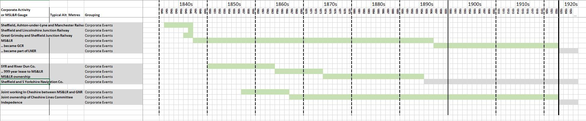
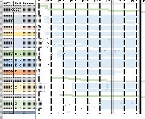
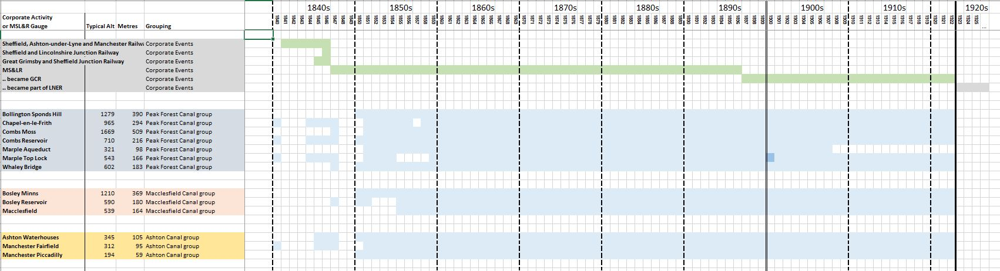

# Determining MS&L Railways Rain Gauge Locations

This note documents my attempt to assign an OS grid reference location to the ~50 rain gauges used by the **[Manchester, Sheffield & Lincolnshire Railway](https://en.wikipedia.org/wiki/Manchester,_Sheffield_and_Lincolnshire_Railway)** company (MS&LR)  and its predecessor and successor companies, based on the information in their rainfall sheets. MS&LR owned and operated a number of canals and waterways in addition to its railways, and sited rain gauges at canal-based locations as well as railway locations.

For a few rain gauges, mainly those relating to the Peak Forest Canal, old OS maps mark the position of the rain gauge; for the rest, the likely location has to be deduced. (Potentially a visit to the locations involved might find old rain gauges still in situ, as in [this example](https://www.zooniverse.org/projects/edh/rainfall-rescue/talk/3143/1358833?comment=2306373&page=20) in Reading, but this has not been attempted.)

If you just want to see the grid references assigned to each MS&LR location, please see the 'Location Summary' sheet of the [MSLR_GaugeInfo spreadsheet](MSLR_GaugeInfo.xlsx).

## Types of Rain Gauge Location ##

In relation to its rain gauges, the name 'MS&L Railways' is misleading. The company actually ran two large networks:
* a *railway network*, consisting of multiple railway lines, each with stations, sidings, tunnels, bridges, ...
* a *canal network*, consisting of multiple canals, each with locks, basins, wharfs, reservoirs and their catchments, ...

MS&LR had rain gauges in both types of locations, and part of the process of locating each rain gauge is to work out which location type applies. 

Rain gauges would seem to have a more direct relevance to canal operation and water management; so in unclear cases, I've been inclined to assign a canal-based location to a rain gauge rather than a railway one. Possible support for this approach comes from the *British Rainfall* annual almanacs, which add a footnote against the first MS&LR entry in the 'Rainfall Stations' table to indicate that *'Gauges are kept for the Canals Department of the MS&LR Company'*. 

There is also a third location type, *private residence*, as a possibility, where the rain gauge is located at the house of someone prominent in MS&LR management.

Another location-type consideration is that the rain gauge needs to be located somewhere that MS&LR (or its joint ventures) owns or controls at the time the gauge was operating. In particular:
* a gauge would not be located at a railway station or by railway lines that were owned by a competitor railway network
* nor would a gauge be located at an MLS&R railway station that had not yet been built
* in cases where a gauge was located somewhere which later stopped being under the control of MS&LR, then if the gauge continued in operation after this point, it is likely to have been relocated to a continuing MS&LR site.

## Key MS&LR Corporate Events ##

The operational dates of the MS&LR rain gauges cover the period 1840 - 1922. During that time their were various important events in the complicated corporate history of MS&LR. Where the operational dates of particular gauges tie in with the dates of important events in MS&LR history, this can help to group the gauges into related sets.

The key MS&LR corporate events in relation to this are:

* in 1847 MS&LR was formed from the merger of three railway companies:
  1) the [Sheffield, Ashton-under-Lyne and Manchester Railway](https://en.wikipedia.org/wiki/Sheffield,_Ashton-under-Lyne_and_Manchester_Railway), including its canal system feeding into Manchester, and the Manchester-Sheffield railway via the Woodhead Tunnel
  2) the [Great Grimsby and Sheffield Junction Railway](https://en.wikipedia.org/wiki/Great_Grimsby_and_Sheffield_Junction_Railway) with its planned railway system in Lincolnshire
  3) the [Sheffield and Lincolnshire Junction Railway](https://en.wikipedia.org/wiki/Sheffield_and_Lincolnshire_Junction_Railway) and its planned railway system to link Sheffield with Chesterfield and Lincoln, and its planned merger with the company which owned the Chesterfield Canal.

  Rainfall sheets from 1850s show 'MS&LR' as the 'observer', making them easy to identify. Rainfall sheets from the 1840s are less helpfully labelled, and have to be linked to the later MS&LR sheets by matching on location names

* in 1864 MS&LR took out a 999 year lease of the [South Yorkshire Railway and River Dun Company](https://en.wikipedia.org/wiki/South_Yorkshire_Railway), which included railways,  canals and other waterways in the South Yorkshire area.
  * this became a take-over by MS&LR in 1874.
  * in 1895 the [Sheffield and South Yorkshire Navigation Company](https://en.wikipedia.org/wiki/Sheffield_and_South_Yorkshire_Navigation) bought the South Yorkshire canal and waterways interests off MS&LR and became a separate company.
* in 1867 MS&LR formed the [Cheshire Lines Committee](https://en.wikipedia.org/wiki/Cheshire_Lines_Committee), a joint venture with Great Northern Railways to run local railway lines in Cheshire and Lancashire.
* in 1897 MS&LR renamed itself as *The Great Central Railway*
  * this name is used on the later MS&LR rainfall sheets
* on 1st January 1923, the Great Central Railway merged with several other railways to form [LNER](https://en.wikipedia.org/wiki/London_and_North_Eastern_Railway)
  * all the MS&LR rain gauge records stop at the end of 1922

## Location clues available from the MS&LR Rainfall Sheets

Compared to other rainfall sheets, the MS&LR rainfall sheets have relatively few detailed location indicators on them:
* the location name is often just the name of the town, e.g. Chesterfield, Barnsley, Worksop
* often there is no explicit indication if the location is  railway-related or canal-related
* there are no 'nearest church' type directions, or latitude and longitude values
* occasionally later additions have been made to the sheets, but it is not clear when these were made or what information they were based on

Aspects of the MS&LR rainfall sheets which can provide information which is used in locating a rain gauge:
- the *location name*; in some cases this is reasonably explicit (e.g. 'Station' or 'Reservoir' is in the name) but often it is just the name of a town or area
- the *altitude*; in some cases this can help to differentiate railway-based and canal-based locations, although in most towns which have both, they are at similar altitudes
- the dates of operation; the MS&LR rain gauges often form sets with very similar start dates. This seems likely to indicate that the gauges in a set have related locations, e.g. by belonging to the same railway or canal. The dates can also tie in to some of the MS&LR corporate events or to dates when particular railway stations were in operation, allowing some location possibilities to be ruled in or out.
- occasionally there are contemporary notes written on the rainfall sheet which provide useful information about the gauge location

## Useful Sources of Information ##

The following general web sites have all proved very useful during this exercise:

|Site|Contents|
|----|--------|
|[Wikipedia](https://en.wikipedia.org/wiki/Manchester,_Sheffield_and_Lincolnshire_Railway)&nbsp;&nbsp;&nbsp;&nbsp;&nbsp;&nbsp;&nbsp;&nbsp;&nbsp;&nbsp;&nbsp;&nbsp;&nbsp;&nbsp;&nbsp;&nbsp;&nbsp;&nbsp;&nbsp;|Information about the history of MS&LR, when railways, stations and canals were built, directors|
|[Rail Map Online](http://www.railmaponline.com/UKIEMap.php)|An enormously detailed historical map of UK and Ireland railway infrastructure. Extremely useful for clarifying which parts of the railway network were and were not owned by MS&LR (identified as *Great Central Railway* on these maps), and for showing the location of old stations. The site is also developing a canal equivalent.|
|[Canal & River Trust](https://canalrivertrust.org.uk/enjoy-the-waterways/canal-and-river-network)|This has a very detailed map of the current canal network.|
|[National Library of Scotland - Maps section](https://maps.nls.uk/)|All sorts of old maps of Britain (not just Scotland), particularly old OS maps showing the railway and canal networks as they were while the MS&LR rain gauges were still in operation, [this](https://maps.nls.uk/geo/explore/#zoom=18&lat=53.49567&lon=-1.83280&layers=168&b=1) for example.

I've also produced an outline of MS&LR's portfolio of railway, canal and other assets [here](portfolio.md).

## Location Identifications ##

The rest of this note lays out the sets of MS&LR rain gauges identified by this process, and the location assignment arrived at for each one. Some of these remain uncertain and debatable.

The [MSLR_GaugeInfo](MSLR_GaugeInfo.xlsx) spreadsheet includes a 'Grouping Timelines' sheet which shows in a visual way the operational date range of each gauge, along with significant MS&LR corporate events. The gauges are grouped into related sets, in rough order of when they became operational.

Detailed screenshots of sections of this 'Timelines' sheet are included below to help explain the location assignment process.

# Manchester Area Canal Locations

The earliest of the MS&LR rain gauges relate to the set of canal systems in the Manchester area which MS&LR inherited from the Sheffield, Ashton-under-Lyne and Manchester Railway company:
* the [Peak Forest Canal](https://en.wikipedia.org/wiki/Peak_Forest_Canal)
* the [Macclesfield Canal](https://en.wikipedia.org/wiki/Macclesfield_Canal)
* the [Ashton Canal](https://en.wikipedia.org/wiki/Ashton_Canal)

They nearly all commence regular rainfall recording in 1850 or 1851, often with some intermittent readings in the 1840s. Many of the mid-1840s readings are referenced in an [1848 report](https://books.google.co.uk/books?id=2RUHAAAAQAAJ) by an MS&LR civil engineer which discussed a scheme to use canal catchment rain water to supply clean water to Manchester.

Most of the locations in these three rain gauge groupings are clearly related to the canal system:

* **Combs Reservoir** provides water for the Peak Forest Canal, with **Combs Moss** being high ground forming part of the catchment area of the reservoir. Both rain gauges are shown on the old OS Map.
* the Toddbrook Reservoir, beside the town of **Whaley Bridge**, also provides water for the Peak Forest Canal. **Sponds Hill** is high ground forming part of the catchment area of the reservoir. Both rain gauges are shown on the old OS Map.

  [Whaley Bridge had to be evacuated in 2019 when the [reservoir slipway nearly collapsed](https://canalrivertrust.org.uk/news-and-views/news/toddbrook-reservoir-update).]
* **Marple Top Lock** and **Marple Aqueduct** are part of the canal infrastructure near the town of Marple, (where the Macclesfield Canal joins the Peak Forest Canal).
* the [Peak Forest Tramway](http://www.pittdixon.go-plus.net/pft/$pft.htm) was used to transport limestone in wagons to the Peak Forest Canal. The Tramway included the gravity-driven ['Inclined Plane'](http://www.pittdixon.go-plus.net/pft/inclined-plane.htm) just outside the town Chapel-en-le-Frith. The **Chapel-en-le-Frith** rain gauge location is at the top of the Inclined Plane - some of the rainfall sheets mention this, and the gauge position is [marked](https://maps.nls.uk/geo/explore/#zoom=18&lat=53.31986&lon=-1.89976&layers=168&b=1) on the old OS map.

* **Bosley Reservoir** provides water for the Macclesfield Canal, with **Bosley Minns** being high ground forming part of the catchment area of the reservoir. The Bosley Reservoir rain gauge is shown on the old OS Map.

* **Ashton Waterhouses** was a set of four locks on the Hollinwood branch of the Ashton Canal

The assignment of the remaining gauge locations in these canal groupings needs a little more explanation, as plausible railway alternatives exist:

* for the **Macclesfield** gauge:
  * the rainfall sheets make no reference to whether this was a railway or canal site; they give an altitude of 539 ft throughout
  * MS&LR did not open a railway station in Macclesfield until 1869, with the Central Station opening in 1873; rain gauge operation began a lot earlier than this, in 1855
  * 539 ft is a good fit for the altitude of the Macclesfield Canal, which runs along the eastern side of Macclesfield, whereas the Central Station altitude is about 100 ft lower
  * so a canal-based location is more likely to be correct
  * the canal in Macclesfield seems not to have locks or basins as obvious places for the rain gauge grid reference, so a spot at Richmond Hill bridge over the canal was arbitrarily chosen to provide an indicative grid reference 

* for the **Manchester Fairfield** gauge:
  * the MS&LR railway and MS&LR's Ashton canal both run through the Fairfield area at a similar altitude
  * Fairfield Station might be a location for the rain gauge; the current station was opened by MS&LR in 1892, with a station further to the west being used before then
  * Fairfield lock on the Ashton Canal, by Fairfield junction where the Hollinwood Branch of the canal, joins might be another possible location
  * the main rainfall sheets make no reference to whether this was a railway or canal site; they give an altitude of 312 ft throughout, no indication of the gauge having been moved
  * one 1840 rainfall sheet does refer to the Ashton & Peak Forest Canal, quoting a very slightly different altitude (320 ft)
  * with nothing conclusive either way, the canal-based location has been chosen to provide the grid reference for this rain gauge. (If the station was chosen instead, this location would fit easily into the Woodhead Railway group of gauges listed later.)
  
  for the **Manchester Piccadilly** gauge:
  * the MS&LR railway and MS&LR's Ashton Canal both terminate in the Piccadilly area of Manchester (i.e. close to the road called Piccadilly)
  * the MS&LR station in the area was called Manchester Store Street initially, and renamed Manchester London Road in 1847. It only became Manchester Piccadilly in 1960.
  * so 'Manchester Piccadilly' on the rainfall sheets is not referring to the railway station
  * the rain gauge location seems likely to be near the Ashton Canal basin, at the point where it joins the Rochdale Canal, near Dulcie Street and the London Road Goods Station.
  
## .. In progress ..
