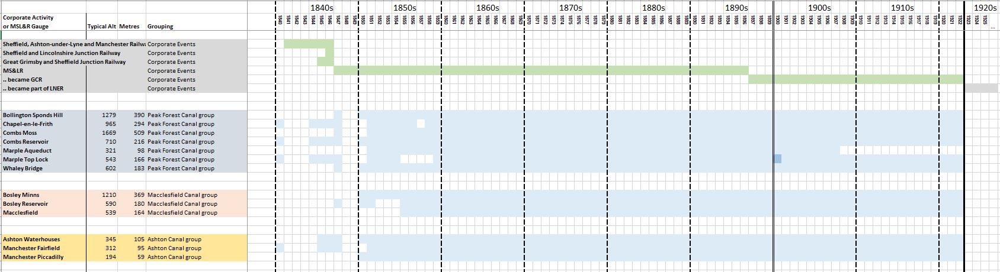

# Determining MS&L Railways Rain Gauge Locations

This note documents my attempt to assign an OS grid reference location to the ~50 rain gauges used by the **[Manchester, Sheffield & Lincolnshire Railway](https://en.wikipedia.org/wiki/Manchester,_Sheffield_and_Lincolnshire_Railway)** company (MS&LR)  and its predecessor and successor companies, based on the information in their rainfall sheets. MS&LR owned and operated a number of canals and waterways in addition to its railways, and sited rain gauges at canal-based locations as well as railway locations.

For a few rain gauges, mainly those relating to the Peak Forest Canal, old OS maps mark the position of the rain gauge; for the rest, the likely location has to be deduced. (Potentially a visit to the locations involved might find old rain gauges still in situ, as in [this example](https://www.zooniverse.org/projects/edh/rainfall-rescue/talk/3143/1358833?comment=2306373&page=20) in Reading, but this has not been attempted.)

If you just want to see the grid references assigned to each MS&LR location in a simple table, without lots of discussion, please see the 'Location Summary' sheet of the [MSLR_GaugeInfo spreadsheet](MSLR_GaugeInfo.xlsx).

## Types of Rain Gauge Location ##

In relation to its rain gauges, the name *'MS&L Railways'* is misleading. The company actually ran two large networks:
* a *railway network*, consisting of multiple railway lines, each with stations, sidings, tunnels, bridges, ...
* a *canal network*, consisting of multiple canals, each with locks, basins, wharfs, reservoirs and their catchments, ...

MS&LR had rain gauges in both types of locations, and part of the process of locating each rain gauge is to work out which location type applies. 

Rain gauges would seem to have a more direct relevance to canal operation and water management; so in unclear cases, I've been inclined to assign a canal-based location to a rain gauge rather than a railway one. Possible support for this approach comes from the *British Rainfall* annual almanacs, which add a footnote against the first MS&LR entry in the *'Rainfall Stations'* table to indicate that *'Gauges are kept for the Canals Department of the MS&LR Company'*. 

There is also a third location type, *private residence*, as a possibility, where the rain gauge is located at the house of someone prominent in MS&LR management.

Another location-type consideration is that the rain gauge needs to be located somewhere that MS&LR (or its joint ventures) owns or controls at the time the gauge was operating. In particular:
* a gauge would not be located at a railway station or by railway lines that were owned by a competitor railway network
* nor would a gauge be located at an MLS&R railway station that had not yet been built
* in cases where a gauge was located somewhere which later stopped being under the control of MS&LR, then if the gauge continued in operation after this point, it is likely to have been relocated to a continuing MS&LR site.

## Key MS&LR Corporate Events ##

The operational dates of the MS&LR rain gauges cover the period 1840 - 1922. During that time their were various important events in the complicated corporate history of MS&LR. Where the operational dates of particular gauges tie in with the dates of important events in MS&LR history, this can help to group the gauges into related sets.

The key MS&LR corporate events in relation to this are:

* in 1847 MS&LR was formed from the merger of three railway companies:
  1) the [Sheffield, Ashton-under-Lyne and Manchester Railway](https://en.wikipedia.org/wiki/Sheffield,_Ashton-under-Lyne_and_Manchester_Railway), including its canal system feeding into Manchester, and the Manchester-Sheffield railway via the Woodhead Tunnel
  2) the [Great Grimsby and Sheffield Junction Railway](https://en.wikipedia.org/wiki/Great_Grimsby_and_Sheffield_Junction_Railway) with its planned railway system in Lincolnshire
  3) the [Sheffield and Lincolnshire Junction Railway](https://en.wikipedia.org/wiki/Sheffield_and_Lincolnshire_Junction_Railway) and its planned railway system to link Sheffield with Chesterfield and Lincoln, and its planned merger with the company which owned the Chesterfield Canal.

  Rainfall sheets from 1850s show *'MS&LR'* as the 'observer', making them easy to identify. Rainfall sheets from the 1840s are less helpfully labelled, and have to be linked to the later MS&LR sheets by matching on location names

* in 1864 MS&LR took out a 999 year lease of the [South Yorkshire Railway and River Dun Company](https://en.wikipedia.org/wiki/South_Yorkshire_Railway), which included railways,  canals and other waterways in the South Yorkshire area.
  * this became a take-over by MS&LR in 1874.
  * in 1895 the [Sheffield and South Yorkshire Navigation Company](https://en.wikipedia.org/wiki/Sheffield_and_South_Yorkshire_Navigation) bought the South Yorkshire canal and waterways interests off MS&LR and became a separate company.
* in 1867 MS&LR formed the [Cheshire Lines Committee](https://en.wikipedia.org/wiki/Cheshire_Lines_Committee), a joint venture with Great Northern Railways to run local railway lines in Cheshire and Lancashire.
* in 1897 MS&LR renamed itself as the [Great Central Railway](https://en.wikipedia.org/wiki/Great_Central_Railway)
  * this name is used on the later MS&LR rainfall sheets
* on 1st January 1923, the Great Central Railway merged with several other railways to form [LNER](https://en.wikipedia.org/wiki/London_and_North_Eastern_Railway)
  * all the MS&LR rain gauge records stop at the end of 1922

## Location clues available from the MS&LR Rainfall Sheets

Compared to other rainfall sheets, the MS&LR rainfall sheets have relatively few detailed location indicators on them:
* the location name is often just the name of the town, e.g. Chesterfield, Barnsley, Worksop
* often there is no explicit indication if the location is  railway-related or canal-related
* there are no 'nearest church' type directions, or latitude and longitude values
* occasionally later additions have been made to the sheets, but it is not clear when these were made or what information they were based on

Aspects of the MS&LR rainfall sheets which can provide information which is used in locating a rain gauge:
- the *location name*; in some cases this is reasonably explicit (e.g. 'Station' or 'Reservoir' is in the name) but often it is just the name of a town or area
- the *altitude*; in some cases this can help to differentiate railway-based and canal-based locations, although in most towns which have both, they are at similar altitudes
- the dates of operation; the MS&LR rain gauges often form sets with very similar start dates. This seems likely to indicate that the gauges in a set have related locations, e.g. by belonging to the same railway or canal. The dates can also tie in to some of the MS&LR corporate events or to dates when particular railway stations were in operation, allowing some location possibilities to be ruled in or out.
- occasionally there are contemporary notes written on the rainfall sheet which provide useful information about the gauge location

## Useful Sources of Information ##

The following general web sites have all proved very useful during this exercise:

|Site|Contents|
|----|--------|
|[Wikipedia](https://en.wikipedia.org/wiki/Manchester,_Sheffield_and_Lincolnshire_Railway)&nbsp;&nbsp;&nbsp;&nbsp;&nbsp;&nbsp;&nbsp;&nbsp;&nbsp;&nbsp;&nbsp;&nbsp;&nbsp;&nbsp;&nbsp;&nbsp;&nbsp;&nbsp;&nbsp;|Information about the history of MS&LR, when railways, stations and canals were built, directors|
|[Rail Map Online](http://www.railmaponline.com/UKIEMap.php)|An enormously detailed historical map of UK and Ireland railway infrastructure. Extremely useful for clarifying which parts of the railway network were and were not owned by MS&LR (identified as *Great Central Railway* on these maps), and for showing the location of old stations. The site is also developing a canal equivalent.|
|[Canal & River Trust](https://canalrivertrust.org.uk/enjoy-the-waterways/canal-and-river-network)|This has a very detailed map of the current canal network (but does not show canals or sections of canals which no longer exist).|
|[National Library of Scotland - Maps section](https://maps.nls.uk/)|All sorts of old maps of Britain (not just Scotland), particularly old OS maps showing the railway and canal networks as they were while the MS&LR rain gauges were still in operation, [this](https://maps.nls.uk/geo/explore/#zoom=18&lat=53.49567&lon=-1.83280&layers=168&b=1) for example.

I've also produced an outline of MS&LR's portfolio of railway, canal and other assets [here](portfolio.md).

## Location Identifications ##

The rest of this note lays out the sets of MS&LR rain gauges identified by this process, and the location assignment arrived at for each one. Some of these remain uncertain and debatable.

The [MSLR_GaugeInfo](MSLR_GaugeInfo.xlsx) spreadsheet includes a 'Grouping Timelines' sheet which shows in a visual way the operational date range of each gauge, along with significant MS&LR corporate events. The gauges are grouped into related sets, in rough order of when they became operational.

Detailed screenshots of sections of this 'Timelines' sheet are included below to help explain the location assignment process.

## 'Manchester Area Canals' Rain Gauge Locations

The earliest of the MS&LR rain gauges relate to the canals in the Manchester area which MS&LR inherited from the Sheffield, Ashton-under-Lyne and Manchester Railway company:
* the [Peak Forest Canal](https://en.wikipedia.org/wiki/Peak_Forest_Canal)
* the [Macclesfield Canal](https://en.wikipedia.org/wiki/Macclesfield_Canal)
* the [Ashton Canal](https://en.wikipedia.org/wiki/Ashton_Canal)

In most cases, regular rainfall recording at these locations begins in 1850 or 1851, often with some intermittent readings in the 1840s. Many of the mid-1840s readings are referenced in an [1848 report](https://books.google.co.uk/books?id=2RUHAAAAQAAJ) produced by Samuel Homersham, an MS&LR civil engineer, which discussed a proposal to use MS&LR canal catchment rain water to supply clean water to Manchester.

For most of the rain gauges assigned to these canal groupings, there is a clear link to a canal system:

* **Combs Reservoir** provides water for the Peak Forest Canal, with **Combs Moss** forming part of the catchment area of the reservoir. Both rain gauges are shown on an old OS Map.
* the Toddbrook Reservoir, beside the town of **Whaley Bridge**, also provides water for the Peak Forest Canal. **Sponds Hill** forms part of the catchment area of the reservoir. Both rain gauges are shown on an old OS Map.

  [Whaley Bridge had to be evacuated in 2019 when the [reservoir slipway nearly collapsed](https://canalrivertrust.org.uk/news-and-views/news/toddbrook-reservoir-update).]
* **Marple Top Lock** and **Marple Aqueduct** are part of the canal infrastructure near the town of Marple, (where the Macclesfield Canal joins the Peak Forest Canal).
* the [Peak Forest Tramway](http://www.pittdixon.go-plus.net/pft/$pft.htm), was used to transport limestone in wagons to the Peak Forest Canal. The Tramway included the gravity-driven ['Inclined Plane'](http://www.pittdixon.go-plus.net/pft/inclined-plane.htm) just outside the town of Chapel-en-le-Frith. The **Chapel-en-le-Frith** rain gauge is actually at the top of the Inclined Plane - some of the rainfall sheets mention this, and the gauge position is [marked](https://maps.nls.uk/geo/explore/#zoom=18&lat=53.31986&lon=-1.89976&layers=168&b=1) on an old OS map.

* **Bosley Reservoir** provides water for the Macclesfield Canal, with **Bosley Minns** forming part of the catchment area of the reservoir. The Bosley Reservoir rain gauge is shown on the old OS Map.

* **Ashton Waterhouses** was a set of four locks on the Hollinwood branch of the Ashton Canal.

For the remaining rain gauges assigned to these canal groupings, a little more explanation is needed, as plausible railway alternatives exist:

* for the **Macclesfield** gauge:
  * the rainfall sheets make no reference to whether this was a railway or canal site; they give an unchanging altitude of 539 ft
  * MS&LR did not open a railway to Macclesfield until the 1860s, and had no station there until 1869, with the Central Station opening in 1873; but rain gauge operation began a lot earlier than this, in 1855
  * 539 ft is a good fit for the altitude of the Macclesfield Canal, which runs along the hillside on the eastern side of Macclesfield, whereas the Central Station altitude is about 100 ft lower
  * .. and so a canal-based location for the rain gauge seems likely
  * the canal in Macclesfield has no locks or basins as obvious places for the rain gauge grid reference, so a spot at Richmond Hill bridge over the canal has arbitrarily been chosen to provide an indicative grid reference 

* for the **Manchester Fairfield** gauge:
  * the MS&LR railway and MS&LR's Ashton canal both run through the Fairfield area, at a similar altitude
  * Fairfield Station might be a location for the rain gauge; the current station was opened by MS&LR in 1892, with a station further to the west being used before then
  * Fairfield Lock on the Ashton Canal, by Fairfield junction where the Hollinwood Branch of the canal splits off, might be a possible canal-based location
  * the main rainfall sheets make no reference to whether this was a railway or canal site; they give an altitude of 312 ft throughout, with no indication of the gauge having been moved
  * one 1840 rainfall sheet does refer to the Ashton & Peak Forest Canal, quoting a very slightly different altitude (320 ft)
  * with nothing conclusive either way, the canal-based location has been chosen to provide the grid reference for this rain gauge. (If the early railway station location was chosen instead, it would fit easily into the 'Woodhead Railway' group of gauges listed later.)
  
  for the **Manchester Piccadilly** gauge:
  * the MS&LR railway and MS&LR's Ashton Canal both terminate in the Piccadilly area of Manchester (i.e. close to the street called *Piccadilly*)
  * the MS&LR station in the area was called *Manchester Store Street* initially, and renamed *Manchester London Road* in 1847. This station only became known as *Manchester Piccadilly* in 1960, so the location 'Manchester Piccadilly' on the rainfall sheets is not referring to the railway station
  * the rain gauge location seems likely to be near the Ashton Canal basin and wharfs, at the point where the Ashton and Rochdale Canals meet, near Dulcie Street and the London Road Goods Station, just off Piccadilly.
  
## 'Woodhead Railway' Rain Gauge Locations

One of MS&LR's predecessor companies, the 
Sheffield, Ashton-under-Lyne and Manchester Railway, built the [Woodhead Line ](https://en.wikipedia.org/wiki/Woodhead_line) between Manchester and Sheffield, via the [Woodhead Tunnel](https://en.wikipedia.org/wiki/Woodhead_Tunnel) through the Pennines. The line opened in 1845, with its Sheffield terminus moved to Sheffield Victoria Station in 1851.

A set of MS&LR rain gauges are located at their stations along the Woodhead line, with most of the gauges beginning operations in the early 1850s:

* **Newton**
* **Mottram Station** [now called Broadbottom Station]
* **Woodhead Station**
* **Dunford Bridge Station**
* **Penistone Hazlehead**
* **Penistone**
* **Wortley**
* **Sheffield Victoria Station**

Of these, only *Wortley* has a plausible non-railway location option. Wortley Hall, close to Wortley Station and at a similar altitude, was owned by the [Earl of Warncliffe](https://www.wikiwand.com/en/Earl_of_Wharncliffe) who was chairman of MS&LR, and so this might fit into the 'Private Residence' group of gauges, especially as this rain gauge has a much later operational start date.

A few other notes on some of these locations:
* the early rainfall sheets for *Mottram Station* refer to it as *Mottram Matley's Field* instead. The 1890s sheet says the gauge moved 125 yards to the station in 1897, and records an altitude which is 50 ft higher. The original position of the gauge, in the field, is shown on the old OS Map, and is used as the grid reference for this location.
* the 1920s *Penistone* rainfall sheet has a note saying the gauge is on the corner of a platform of the goods station, west of the passenger station. The goods station was the original Penistone passenger station, replaced in 1875.
* the 1920s *Penistone Hazlehead* rainfall sheet has a note saying the gauge is in a small enclosed meadow. This is presumably close to Hazlehead Bridge station.

## 'Chesterfield Canal' Rain Gauge Locations

MS&LR bought the [Chesterfield Canal](https://en.wikipedia.org/wiki/Chesterfield_Canal) in 1847. The canal ran from Chesterfield to West Stockwith on the River Trent, passing through the Norwood Tunnel, Worksop and Retford on the way.

A set of MS&LR rain gauges are located on the route of the canal, and all have rainfall measurements starting in 1855 or shortly afterwards. Some of these locations seem very likely to be canal-based:

* **Chesterfield** had no MS&LR railway or station until 1893, long after the rain gauge started operations. 
* West **Stockwith**, where the Chesterfield Canal joins the Trent does not have a railway, and there is no MS&LR railway line nearby
* the Chesterfield Canal runs through a set of locks at **[Killamarsh] Norwood** just before entering the Norwood Tunnel. There are no MS&LR railway lines near to Norwood.

For the other two locations, **Retford** and **Worksop**, there is a possibility of these being railway-related rather than canal-based, as the MS&LR Sheffield to Gainsborough line runs through these towns. There's no clear evidence one way or the other:
* Retford and Worksop start recording rainfall in exactly the same month (may 1855) as Chesterfield and Stockwith, which are almost certainly canal-based locations
* neither Retford's nor Worksops's rainfall sheets included 'Station' in their initial location name
* but 'Station' has been retrospectively (time unknown) added to the Worksop sheets, without explanation
* there's no significant altitude difference between the canal and railway locations

In the absence of clear 'railway' indicators, Retford and Worksop are both being treated as canal-based rain gauge locations. (If one or both was to be treated as being a railway-based location, then a separate group of rain gauge(s) for the Sheffield to Gainsborough line would be in order.)

A few other notes on the location of the Chesterfield Canal rain gauges:
* Chesterfield's rain gauge shows some small changes in altitude during the 1890s and 1900s, around the time MS&LR were extending their railway network to Chesterfield and opening a station there. Chesterfield's 1920s rainfall sheet notes that the rain gauge is at the northern end of the platform near the signal box. Taken together, it seems likely that the Chesterfield rain gauge was moved from its initial canal-based location to the newly-built railway station in the 1890s or 1900s.
* the Killamarsh Norwood rainfall sheets show a change in altitude from 1902. The initial altitude and the new altitude are both compatible with the Chesterfield Canal in the Norwood area - perhaps the gauge was moved to a different lock ?

## 'Lincolnshire Railways' Rain Gauge Locations

A set of MS&LR rain gauges are located at their railway stations in Lincolnshire, with the gauges all beginning operations in March 1859:

* **Barnetby**
* **Brigg**
* **Gainsborough**
* **Grimsby** [the 'Town' Station]
* **Lincoln** [St Marks Station]
* **Market Rasen**
* **New Holland** [the old 'Town' Station]

There are no canal complications for these locations.

The location of the New Holland rain gauge is shown on the old OS Map.

## 'Private Residence' Rain Gauge Locations

A few of the MS&LR rain gauge locations were located at private residences rather than at canal or railway sites. They all started reporting rainfall measurements in Spring 1860:

* **Gate Burton** near Gainsborough was owned by George Morland Hutton who was a director of Great Central Railway
* **Mottram Hill End** near the Mottram Station location was owned by John Chapman, MP for Great Grimsby and a director of MS&LR. His son Edward Chapman also lived there and was a director of Great Central Railway. The rain gauge at Hill End is shown on the old OS Map.
* **Penistone Carlcotes** - John Chapman also owned Carlecotes, between Dunford Bridge and Hazlehead. So it seems he had two houses near the Woodhead line, one on each side of the Woodhead Tunnel.

**Sheffield Brincliffe Edge** also seems to belong to this set given its start date and lack of any obvious links to MS&LR railway and canal systems. The early rainfall sheets just refer to this location as *Sheffield, The Edge* which is likely to indicate a property called *Edge End* on a track called *The Edge* near Brincliffe Edge. But owner of the property and his or her links to MS&LR have not been determined however.

## 'South Yorkshire Waterways' Rain Gauge Locations

in 1864, MS&LR leased and then in 187 bought a set of South Yorkshire waterways. This included:
* the [Dearne and Dove Canal](https://en.wikipedia.org/wiki/Dearne_and_Dove_Canal)
* the [Sheffield and Tinsley Canal](https://en.wikipedia.org/wiki/Sheffield_%26_Tinsley_Canal)
* the [Stainforth and Keadby Canal](https://en.wikipedia.org/wiki/Stainforth_and_Keadby_Canal)
* the [River Don Navigation](https://en.wikipedia.org/wiki/River_Don_Navigation)

In 1895, MS&LR were forced to sell them all to the [Sheffield and South Yorkshire Navigation Company](https://en.wikipedia.org/wiki/Sheffield_and_South_Yorkshire_Navigation).

Several MS&LR rain gauges are closely linked to locations on these waterways. All but one of the locations comes into operation in April 1867, and most of them have a small change in altitude recorded in the mid 1890s, which may reflect the gauges being relocated from canal-type locations to nearby MS&LR railway locations after the waterways were sold.

The locations concerned were:

* **Barnsley** - the Dearne and Dove Canal passed through the edge of Barnsley, joining up with the Barnsley Canal
* **Elsecar** - the Elsecar branch of the Dearne and Dove Canal ended at a basin and reservoir in Elsecar
* **Worsborough** - the Worsborough branch of the Dearne and Dove Canal ended at a basin and reservoir in Worsborough
* **Doncaster** - the River Don navigation runs along the north-west side of Doncaster
* **Rotherham** - the Rotherham Cut of the River Don navigation runs through Rotherham
* **Sheffield Tinsley Locks** - a set of 7 locks on the Sheffield and Tinsley Canal at the edge of Sheffield
* **Crowle Keadby** - the Stainforth and Keadby Canal joins the River Trent at Keadby

The Rotherham rain gauge only operated for three years 1867-69, with its rainfall sheet reporting that the gauge was moved because it was in the way of a new railway line. The Sheffield Tinsley Locks rain gauge started operating in 1870 - conceivably this was the new location for the Rotherham rain gauge, explaining why the Sheffield location started reporting after the other locations in this set.

Most of the rain gauges report a change of altitude, usually in the mid-1890s, tying in with the date when the waterways becoming independent of MS&LR. Rain gauge readings continue for nearly 30 years after this, still in the name of MS&LR (and its successor GCR), implying that gauges at waterways sites had probably been relocated to a nearby MS&LR railway site. There were MS&LR railway lines close to the various waterways (often running parallel to them), but not necessarily stations.

## 'Cheshire Lines Railway' Rain Gauge Locations

MS&LR formed the [Cheshire Lines Railway](https://en.wikipedia.org/wiki/Cheshire_Lines_Committee) joint venture with Great Northern Railway to operate a set of local railway lines in Cheshire, Lancashire (and North Wales).

In 1889, after a period of expansion, MS&LR started to operate rain gauges at locations on some of these lines, mostly at stations:

* **Chester Northgate Station**
* **Liverpool Huskisson Station**
* **Northwich**
* **Southport Lord Street Station**
* **Warrington Central Station**

A couple of locations are less clear:
* **Hawarden** - this rain gauge cannot be located at Hawarden Station (in North Wales) or anywhere nearby. The rainfall sheets give the altitude of the gauge as just 35 ft, where Hawarden Station and the town of Hawarden is at around 250 ft. *Hawarden Bridge* railway bridge across the River Dee (2-3 miles from Hawarden itself) seems a possible site for the gauge at about the right altitude.
* **Oldham Honeywell Lane** - the only connection to MS&LR at this site is its bridge over the [Oldham, Ashton and Guide Bridge Railway](https://en.wikipedia.org/wiki/Oldham,_Ashton_and_Guide_Bridge_Railway), which was another MS&LR joint venture railway. The bridge or nearby sidings may be the location of this rain gauge.

## Other Rain Gauge Locations

A couple of very short-lived MS&LR rain gauges do not fit in the above classification, and very little is known about them:

* **Combs House** only reported rainfall figures for 10 months in 1855. It has not been located on a map, but was presumably in the same area as Combs Reservoir, which is part of the Peak Forest Canal rain gauges.
* **Rochdale** only reported rainfall figures for two years, 1863 and 1864. There is no obvious relationship to any of the other MS&LR gauges, and MS&LR did not have canal or railway networks in the area. One very weak connection is that the MS&LR's Ashton Canal joins the Rochdale Canal near the middle of Manchester.

