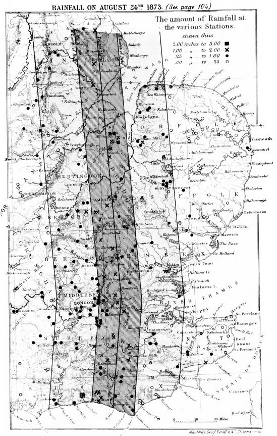

# Rain Gauge Maps in *British Rainfall*

The annual *British Rainfall* almanacs sometimes contained useful maps showing the location of rain gauges in selected parts of the country. Here are images of some of the maps I spotted in the earlier editions.

Contents:
* [Great Britain and Ireland](#great-britain-and-ireland)
* [Wales](#wales)
* [The North of Scotland](#the-north-of-scotland)
* [Border Counties](#border-counties)
* [Devon and Cornwall](#devon-and-cornwall)
* [Eastern England](#eastern-england)
* [The Lake District](#the-lake-district)

# Great Britain and Ireland

This image is actually from [GJ Symons 1865 report for the British Association for the Advancement of Science](https://archive.org/details/reportofbritisha66brit/page/n263/mode/1up).

# Wales

## *British Rainfall* 1864, p1

The Key to the map is on p5:

## *British Rainfall* 1867, p1

The Key to the map is on p13:

# The North of Scotland

## *British Rainfall* 1872, p1

# Border Counties

## *British Rainfall* 1872, p156

# Devon and Cornwall

## *British Rainfall* 1871, p1

The Key to the map is on p179-181 in the main table of stations:
||||
|----|----|----|
||||
||||

# Eastern England

## *British Rainfall* 1872, p1

# The Lake District

## *British Rainfall* 1864, p1

## *British Rainfall* 1872, p158

(There is an earlier version in BR 1867, p22)

The Key to the map is on p195-197 in the main table of stations:
||||
|----|----|----|
||||
||||

## *British Rainfall* 1896, p22 and p23, Seathwaite area

See the chapter entitled '*The Most Rainy Part of England*' in BR 1896 for the identities of the labelled gauges.

## *British Rainfall* 1931, p18, Seathwaite area

BR 1931 has a section labelled *Rain-gauges in and near Borrowdale* which starts on P17 describing the state of the Seathwaite area rain gauges (including The Stye and Stye Head Tarn) following an inspection visit by Dr Glasspoole.

