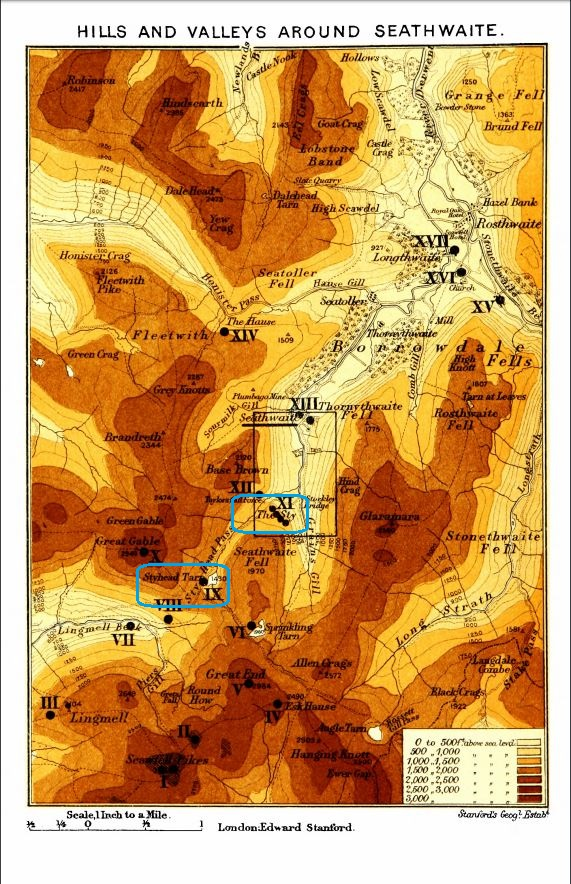
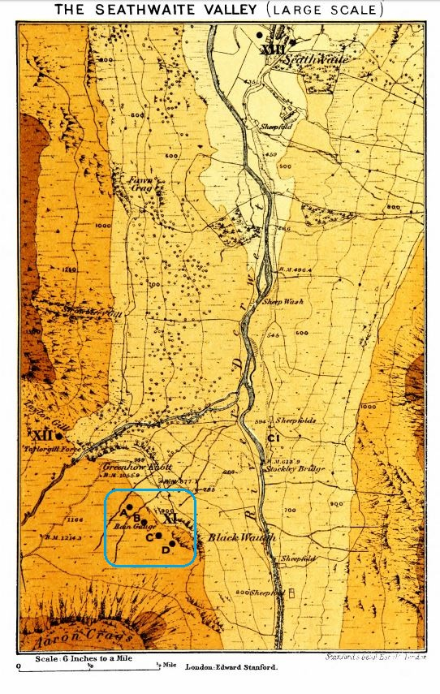
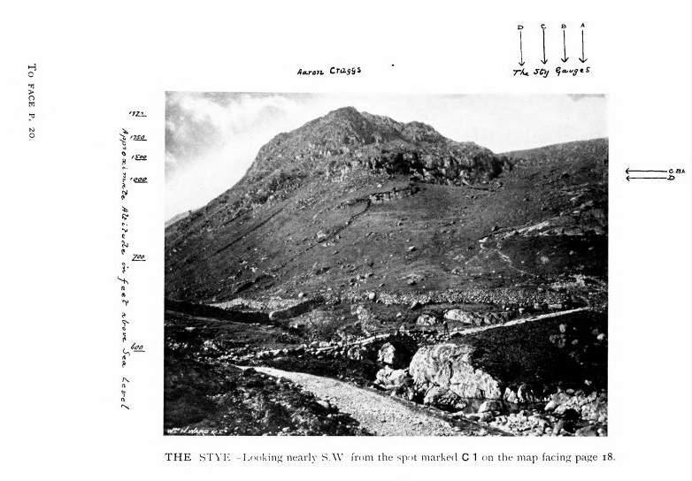

# Stye Rain Gauges

Brief notes on two similarly-named but distinct rain gauge locations, at the far end of Borrowdale in the Lake District near Great Gable:
i) **Stye Head Tarn** and ii) **The Stye**. 
[*British Rainfall 1896*](https://digital.nmla.metoffice.gov.uk/IO_f636c14a-e573-4787-839e-c0168dcf0dbf/) includes a chapter on *'The Most Rainy Part of England'* which describes the rain gauges in the Seathwaite area, with helpful maps and photos that are reproduced below.

## Locations

**Stye Head Tarn** (Grid reference NY 220097) lies between Seathwaite Fell and Great Gable, at an altitude of around 1470 ft, near the top of the Stye Head Pass.

**The Stye** (Grid reference NY 231107) is located 400 ft lower down the slopes of Seathwaite Fell, on fairly level ground between Aaron Crags and Black Waugh, altitude about 1080 feet. There were a set of 4 rain gauges there: A, B, C and D; they have a complex history - see British Rainfall 1896 for details.

The altitude figure on rainfall sheets gives the easiest way of distinguishing the two sites. Other than the altitude, reliable location name differentiators are:
* 'Tarn' (or the mis-transcription 'Farm') indicates *Stye Head Tarn* rather than *The Stye*
* 'A', 'B', 'C' or 'D' gauge indicators indiate *The Stye* rather than *Stye Head Tarn*

## British Rainfall 1896 Maps

*British Rainfall 1896* includes two colourful maps showing the location of rain gauges around Seathwaite. 

The first map shows both 'Stye' locations:

* *Stye Head Tarn* is labelled as **IX**
* *The Stye* is labelled as **XI**

The second map shows the area within the rectangle on the first map at a larger scale.

Larger scale map, giving a clearer view of the where The Stye gauges were located.

## Photo

*British Rainfall 1896* also includes a photo showing the location of The Stye, taken from the point labelled **C1** on the large scale map.

## GitHub

The [Rainfall Rescue GitHub](https://github.com/ed-hawkins/rainfall-rescue) folders for the two sites are:
* [STYE-HEAD-TARN](https://github.com/ed-hawkins/rainfall-rescue/tree/master/DATA/STYE-HEAD-TARN)
* [THE-STYE](https://github.com/ed-hawkins/rainfall-rescue/tree/master/DATA/THE-STYE)
